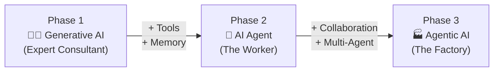
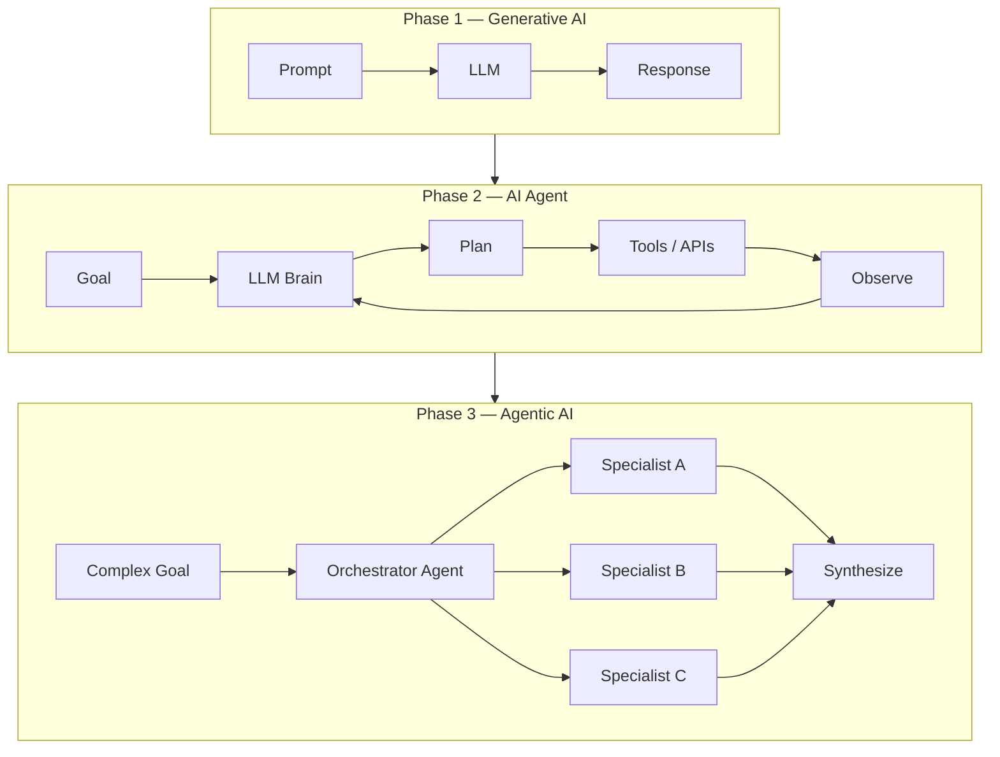

# 01 — Evolution of AI: GenAI → AI Agent → Agentic AI

> **Key idea:** Three distinct phases, each adding a new capability layer on top of the previous.

---

## Three Phases at a Glance

---

## Phase 1 — Generative AI ("The Expert Consultant")

| Property | Detail |
|----------|--------|
| Lifecycle | Single **Request → Response** loop |
| Behaviour | **Passive** — only responds, never initiates |
| State | **Stateless** — no memory of past interactions |
| Analogy | You ask for a plan → it writes a report |

**Key limitation:** Work ends at generation. It cannot take action.

---

## Phase 2 — AI Agent ("The Worker")

> We gave the Expert Consultant **Tools** (its hands) and **Memory** (its notebook).

| Property | Detail |
|----------|--------|
| Lifecycle | Continuous **Perceive → Reason → Act** loop |
| Behaviour | **Active / Proactive** — can initiate actions |
| State | **Stateful** — maintains internal memory of plan & history |
| Analogy | A developer you tell *what* to build, not *how* to code it |

---

## Phase 3 — Agentic AI ("The Factory")

> Multiple collaborating agents — each specialised — solving goals no single agent could.

| Property | Detail |
|----------|--------|
| Scope | An entire **system** of agents |
| Behaviour | **Collaborative** — orchestration and choreography |
| State | **Shared state** across agents |
| Analogy | A software company with a project manager + specialist teams |

---

## Comparison Table

| Feature | Phase 1: GenAI | Phase 2: AI Agent | Phase 3: Agentic AI |
|---------|---------------|-------------------|---------------------|
| **Analogy** | Expert Consultant | The Worker | The Factory / Team |
| **Scope** | Single brain (LLM) | Single component | Entire system |
| **Input** | Prompt | Goal | Complex goal |
| **Action** | Passive (answers) | Active (executes tools) | Collaborative (orchestrates) |
| **State** | Stateless | Stateful (internal memory) | Stateful (shared memory) |

---

## The Architectural Shift

---

## When NOT to Use an Agent

> **The Golden Rule:** If you can write a function, do that.

| Situation | Use |
|-----------|-----|
| Simple, deterministic task | ✅ Script / Function |
| Complex but steps are defined | ✅ Traditional Workflow |
| Complex, open-ended, dynamic environment | ✅ AI Agent |

**Red flags for using an agent unnecessarily:**
- Task is deterministic and highly structured
- 100% predictability is required
- Simple information retrieval (basic RAG is sufficient)
- No clear goal or ability to act

**Green lights for using an agent:**
- Open-ended / "under-specified" goal
- Multi-step, multi-tool process
- Dynamic environment (things change mid-task)
- Designed for improvement over time
- Conversational, collaborative interface

---

> ⬅️ [Back to README](./README.md) | ➡️ [02 — Agent Fundamentals](./02_agent_fundamentals.md)
