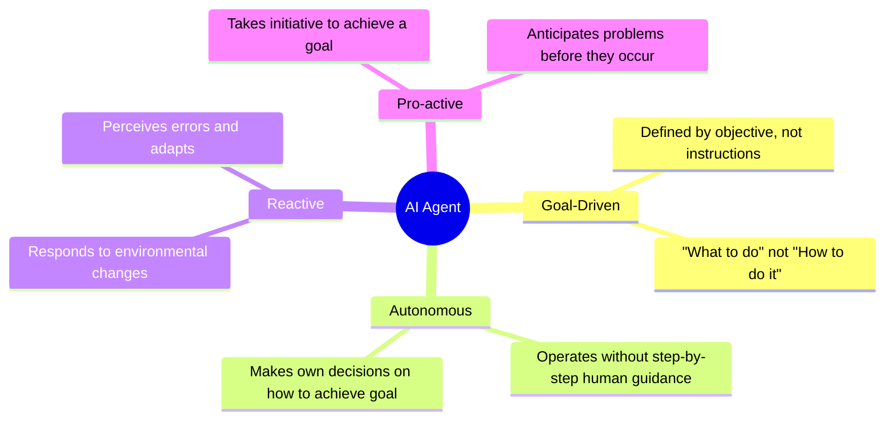
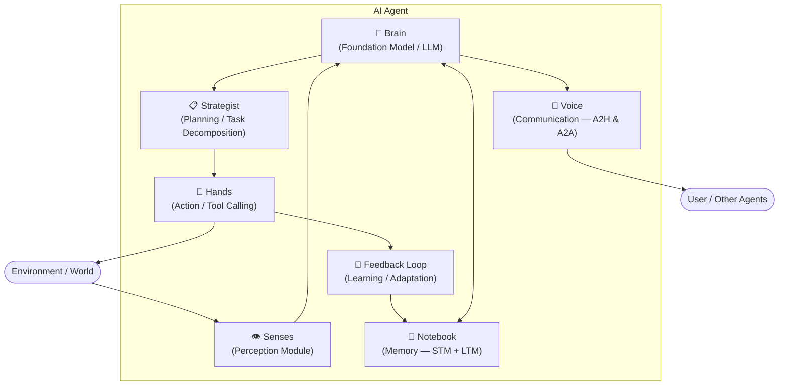
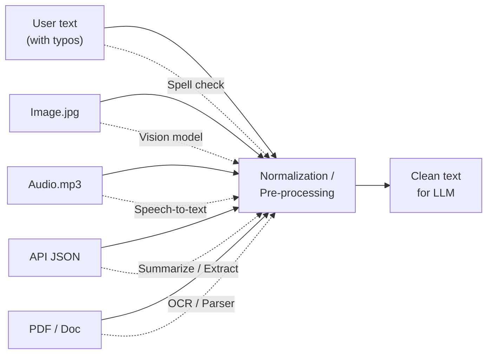
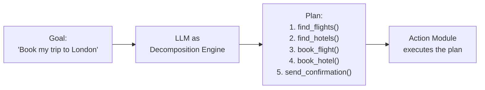
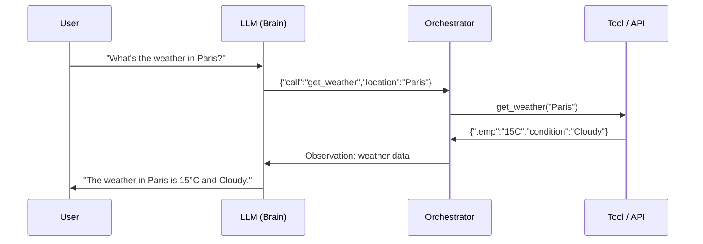
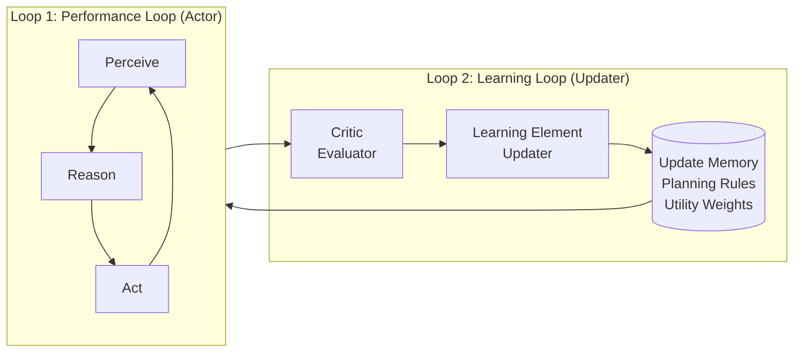
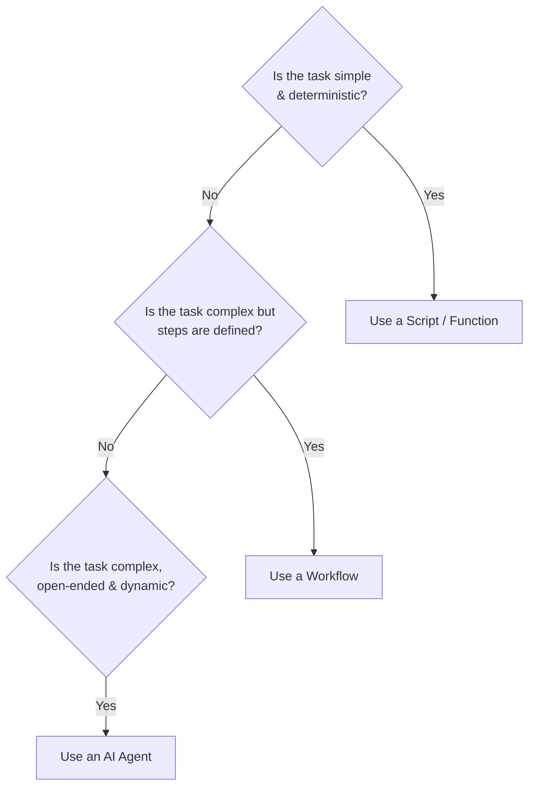

# 02 — AI Agent Fundamentals

> **Key idea:** An agent = Goal-Driven + Autonomous + Reactive + Pro-active. It is a new class of software component.

---

## Formal Definition

An AI Agent is a system that:
1. **Perceives** its environment
2. **Reasons** to make decisions
3. **Acts** autonomously to achieve its goals

---

## The 4 Key Principles

### Principle 1 — Goal-Driven
| | Example |
|--|---------|
| **Script** | "Run this report at 5 PM" |
| **Agent** | "Ensure the executive team has fresh sales data every morning" |

The agent is defined by its **objective**, not its instructions.

### Principle 2 — Autonomy
You tell it **WHAT** to do, not **HOW** to do it.  
Like telling a developer "Build this feature", not "Type these lines of code".

### Principle 3 — Reactivity
The real world is dynamic. When an API returns a 500 error:
- **Script** → crashes
- **Agent** → perceives the error, reasons about it, retries or reroutes

### Principle 4 — Pro-activeness
| | Server Monitoring Example |
|--|--------------------------|
| **Reactive** | "Alert! Server disk is 100% full!" |
| **Pro-active** | "Server disk is 90% full. Archiving old logs to prevent crash." |

---

## The 7 Core Components ("The Agent's Anatomy")

---

### Component 1 — The Brain (Foundation Model / LLM)

- The agent's **CPU** — its central reasoning engine
- Trained on massive datasets; predicts the most logical next token
- The **System Prompt** acts as the "Operating System" for the brain
- Enables reasoning via **Chain of Thought (CoT)** and **ReAct**

**Architect's LLM choice tradeoffs:**

| Option | Capability | Cost | Latency | Use Case |
|--------|-----------|------|---------|----------|
| Max Capability (GPT-5, Claude 4 Opus) | ⭐⭐⭐ | 💰💰💰 | Slow | Complex research, planning |
| Max Speed (Gemini Flash, Llama 8B) | ⭐⭐ | 💰 | Fast | Chatbots, data extraction |
| Max Privacy (Local / Open-source) | ⭐⭐ | 💰💰 (infra) | Medium | Healthcare, finance, sensitive data |

---

### Component 2 — Senses (Perception Module)

The **Perception Module** normalises "messy" real-world inputs into clean LLM-readable text.

**Triggers for the Agentic Loop:**
- Direct: User chat message
- Asynchronous: API response, new file, database update
- Time-based: Scheduled event

---

### Component 3 — Strategist (Planning / Task Decomposition)

Converts a high-level goal into an **ordered sequence of executable tool calls**.

**Planning strategies:**

| Strategy | Behaviour | Use Case |
|----------|----------|---------|
| **Chain of Thought (CoT)** | Generate the entire plan upfront, then execute | Simple, predictable workflows |
| **ReAct (Dynamic Planning)** | Plan one step → execute → perceive → re-plan | Complex, unpredictable environments |

---

### Component 4 — Notebook (Memory)

> Covered in depth in [04_memory_and_rag.md](./04_memory_and_rag.md)

| Type | Analogy | Implementation | Size |
|------|---------|----------------|------|
| **STM** | RAM / Working memory | LLM Context Window | Small, finite, expensive |
| **LTM** | Hard drive / Library | Vector DB, SQL, Key-Value | Vast, persistent, slower |

---

### Component 5 — Hands (Action / Tool Calling)

What separates a passive **chatbot** from an active **agent**.

**The Function Calling Mechanism:**

**Security Guardrails (non-negotiable):**
1. **Least Privilege** — only give the agent the tools it actually needs
2. **Read-Only preference** — prefer `get_*` over `delete_*` or `send_*`
3. **Human-in-the-Loop (HITL)** — pause before any irreversible action

---

### Component 6 — Feedback Loop (Learning)

A **meta-loop** above the performance loop.

**Feedback sources:**
- **Explicit** — user thumbs up/down, corrections
- **Implicit** — API errors, failed tool calls, lost chess games

---

### Component 7 — Voice (Communication)

| Channel | Audience | Format | Goal |
|---------|----------|--------|------|
| **A2H** (Agent-to-Human) | End user | Natural language | Helpfulness, empathy |
| **A2A** (Agent-to-Agent) | Another agent / system | Structured JSON | Precision, machine-readability |

---

## Decision Framework: Tool vs. Agent vs. Workflow

---

> ⬅️ [01 — Evolution](./01_evolution.md) | ➡️ [03 — PRAL Loop](./03_pral_loop.md)
