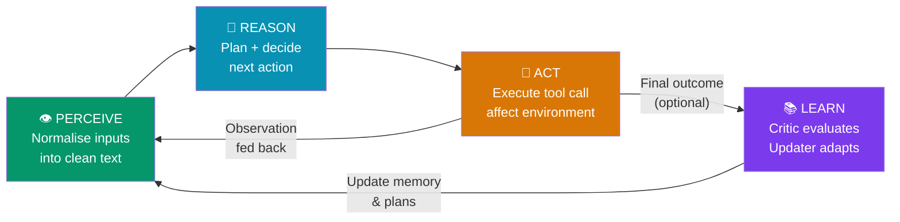
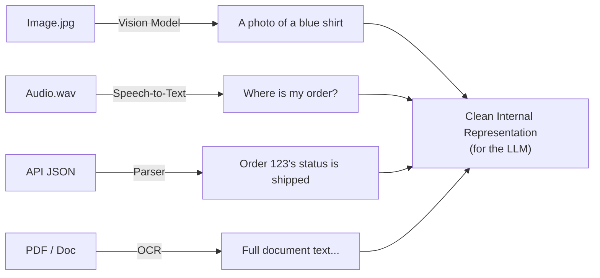
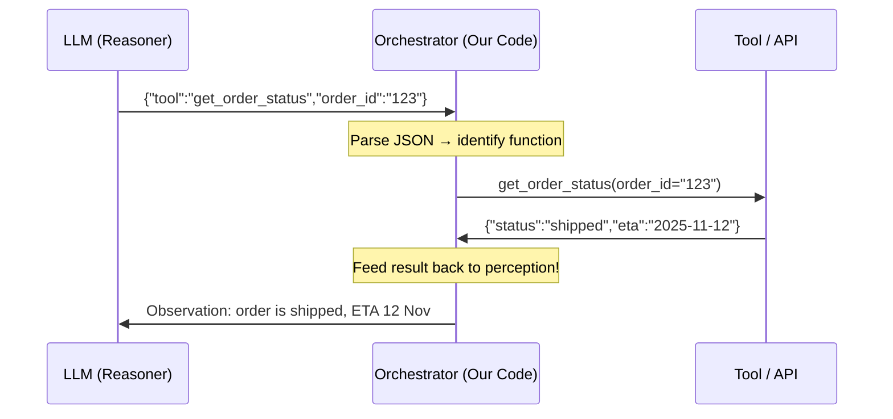
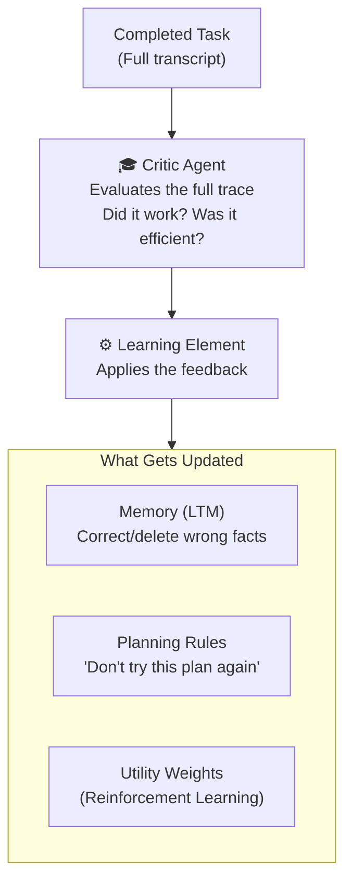
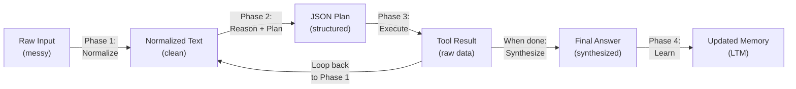

# 03 — The Agentic Loop (PRAL)

> **Key idea:** PRAL = **P**erceive → **R**eason → **A**ct → **L**earn. This is the "heartbeat" or "operating system" of every agent.

---

## The PRAL Loop Overview



---

## Phase 1 — Perceive (The "Gateway")

**Goal:** Get information into the agent's brain in a clean, LLM-readable format.

**Triggers (what starts the loop):**

| Trigger Type | Example |
|-------------|---------|
| User Input | "Where is my order?" |
| API Response | `{"status": "shipped"}` |
| Sensor Data | 25.5°C |
| Scheduled Event | 9 AM daily report |

**The key process — Normalization:**



> This is the **first data transformation** in the loop.

---

## Phase 2 — Reason (The "Brain")

**Input:** `[Normalized Perception]` + `[Relevant Context from Memory]`  
**Goal:** Understand the situation and create a plan.

**The thought process (Chain of Thought):**

1. **Understand** — the LLM interprets full context (perception + memory)
2. **Plan** — decomposes the goal into steps (Chain of Thought)
3. **Decide** — selects the next immediate action (call a tool)

**Output — The Action Plan (JSON):**

```json
{
  "thought": "The user needs order status. I will call get_order_status.",
  "action": {
    "tool": "get_order_status",
    "parameters": { "order_id": "123" }
  }
}
```

> This is the **second data transformation** — LLM "thought" → machine-readable JSON.

---

## Phase 3 — Act (The "Hands")

**Input:** JSON Action Plan from the Reasoning phase  
**Goal:** Execute the plan and affect the environment.



**Critical — "Closing the Loop":**
The tool result is **NOT** the end. It becomes the trigger for the next perception phase, starting Loop 2.

---

## Phase 4 — Learn (The "Meta-Loop")

An **optional** outer loop that sits above PRAL and improves the agent over time.



**Key mechanism for Learning:**
- **Update Memory** → `vector_db.delete(wrong_fact_id)`
- **Update Planning** → store a "memo" in LTM: "plan X failed, avoid it"
- **Update Utility** → increase/decrease weights for specific actions (RL)

---

## The PRAL Data Flow Summary



---

## Case Study 1 — ChatGPT (Digital Domain)

| Phase | What Happens |
|-------|-------------|
| **Perceive** | Voice → Speech-to-Text → "Find fancy seafood restaurant" |
| **Reason** | "User in Seattle, needs real-time data → I'll call web_search" |
| **Act** | `web_search("fancy seafood restaurant Seattle")` |
| **Loop 2 Perceive** | Search results → normalised into text |
| **Loop 2 Reason** | "I have 5 restaurants, I'll synthesise and reply" |
| **Loop 2 Act** | Generate natural language response |

---

## Case Study 2 — Healthcare ICU Agent (Cyber-Physical Domain)

| Phase | What Happens |
|-------|-------------|
| **Perceive** | `vitals.json` (HR: 125) + `radiology_image.dcm` → "Patient 4A unstable, left-side anomaly" |
| **Reason** | Check allergy (penicillin) → Plan: search PubMed + order STAT blood panel |
| **Act** | `search_pubmed(...)` + `order_test(...)` |
| **Loop 2** | New lab results → reason → recommend medication X |
| **HITL** | Plan presented to Doctor → approval → update learning |

> Note the **Human-in-the-Loop** is mandatory before any action in high-stakes domains.

---

## Comparison: ChatGPT vs. Healthcare Agent

| Aspect | ChatGPT (Digital) | Healthcare (Cyber-Physical) |
|--------|-------------------|-----------------------------|
| **Perceives** | User commands | Patient data streams |
| **Reasons with** | Web search | Medical history + specialized DBs |
| **Acts by** | Generating text | Ordering tests, recommending treatment |
| **Learns from** | User thumbs up/down | Doctor approval/correction |
| **HITL required?** | No (low stakes) | Yes (life-critical) |

---

> ⬅️ [02 — Agent Fundamentals](./02_agent_fundamentals.md) | ➡️ [04 — Memory & RAG](./04_memory_and_rag.md)
