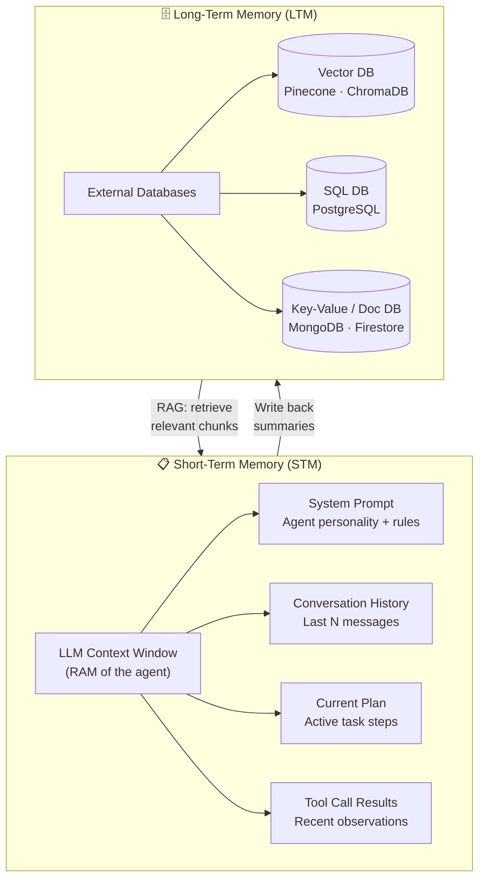
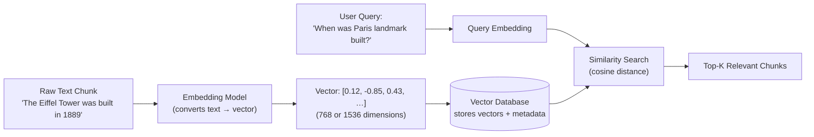
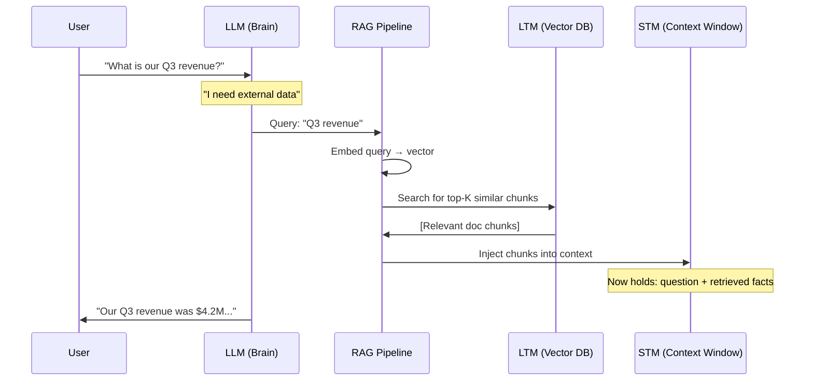
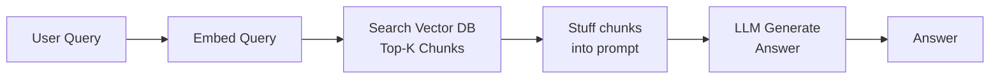
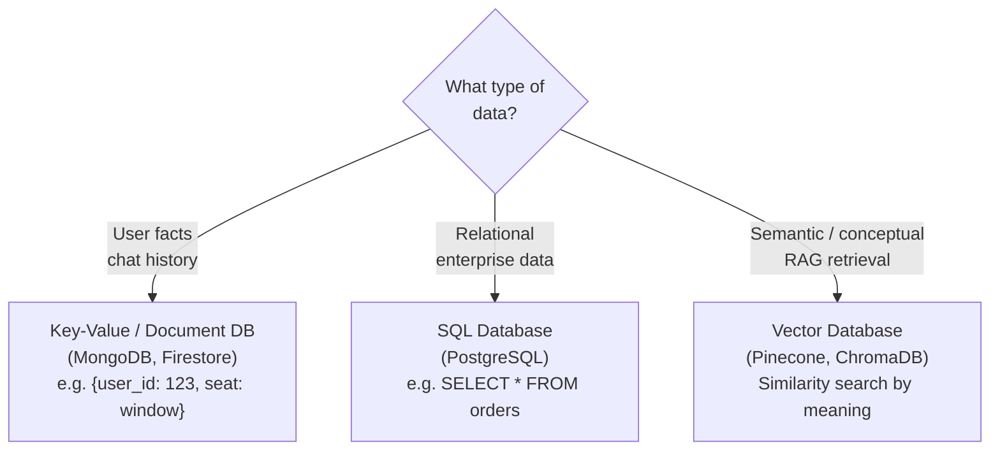

# 04 — Memory (STM & LTM) + RAG

> **Key idea:** Without memory, every perception is a brand-new, context-less event — the "Groundhog Day" problem. We solve it with two types of memory connected by RAG.

---

## The Two Types of Memory



---

## Short-Term Memory (STM) — The Context Window

| Property | Detail |
|----------|--------|
| **Implementation** | LLM's context window |
| **Analogy** | Computer RAM / Conscious thought |
| **Contents** | System prompt, conversation history, current plan, tool results |
| **Characteristics** | Extremely fast, finite size (8k–1M tokens), volatile, expensive |
| **The Problem** | Cannot fit the whole world. Most expensive resource the agent has |

**What STM holds:**

```
┌─────────────────────────────────────────────────┐
│              Context Window (STM)                │
├─────────────────────────────────────────────────┤
│  System Prompt  │ "You are a travel assistant…" │
│  Chat History   │ [Turn 1, Turn 2, Turn 3…]     │
│  Current Plan   │ [Step 1: ✅, Step 2: ⏳]       │
│  Tool Results   │ {"flight": "TK-123"}           │
└─────────────────────────────────────────────────┘
```

---

## Long-Term Memory (LTM) — The Library

| Property | Detail |
|----------|--------|
| **Implementation** | External persistent databases |
| **Analogy** | Hard drive / Library |
| **Contents** | Past conversations, user preferences, large documents, knowledge graphs |
| **Characteristics** | Vast, permanent, cheaper per token, slower to access |
| **Benefit** | The agent doesn't "remember" everything — it knows how to **look things up** |

---

## Choosing Your LTM Store

| DB Type | Best For | Example |
|---------|---------|---------|
| **Key-Value / Document** | Structured facts, chat history, user profiles | `{"user_id":"123","seat":"window"}` |
| **SQL** | Highly relational enterprise data | `SELECT * FROM orders WHERE user_id=123` |
| **Vector DB** | Semantic / conceptual search (RAG) | "How do I feel about modern art?" → finds similar concepts |

---

## Vector Databases — Deep Dive

> A **Vector DB** stores high-dimensional vectors (embeddings) that capture the *semantic meaning* of data, enabling similarity search by concept rather than exact keyword.



---

## How STM and LTM Work Together — RAG

**Retrieval-Augmented Generation (RAG)** is the bridge between LTM and STM.



**The RAG Loop (6 steps):**

1. **Perceive** — User asks a question
2. **Plan** — Brain realises it needs external data
3. **Act (Retrieve)** — Agent searches Long-Term Memory
4. **Retrieve** — LTM returns relevant facts
5. **Augment** — Facts are "loaded" into Short-Term Memory
6. **Generate** — LLM answers with question + retrieved context

---

## Traditional RAG Architecture



> This is a **one-way, linear chain** — passive and brittle.  
> See [08_agentic_rag.md](./08_agentic_rag.md) for the upgrade to **Agentic RAG**.

---

## Memory Patterns for Long-Term Memory



---

## The "Groundhog Day" Problem — Solved

Without memory, the agent:
- Cannot connect Step 1's result to Step 2
- Cannot remember the user's name from last session
- Has no context for follow-up questions

With STM + LTM + RAG:
- STM holds the active working state
- LTM holds everything permanently
- RAG retrieves just-in-time facts into STM — no need to hold everything at once

---

## Quick Reference

| | STM | LTM |
|--|-----|-----|
| **Analogy** | RAM | Hard Drive |
| **Implementation** | Context Window | External DB (Vector / SQL / KV) |
| **Size** | Small, finite | Vast, unlimited |
| **Speed** | Instant | Slower (network call) |
| **Cost** | High (tokens) | Low per-query |
| **Persistence** | Lost on reset | Permanent |
| **Connected by** | ← RAG retrieves from LTM → | RAG pushes to STM |

---

> ⬅️ [03 — PRAL Loop](./03_pral_loop.md) | ➡️ [05 — Multi-Agent Systems](./05_multi_agent_systems.md)
