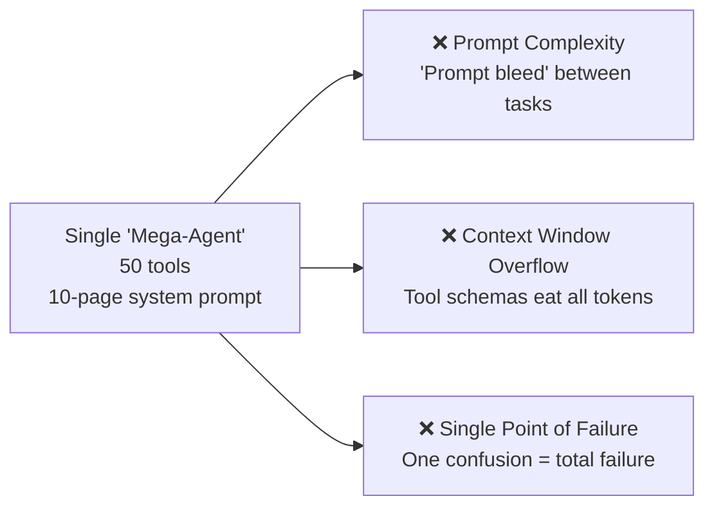
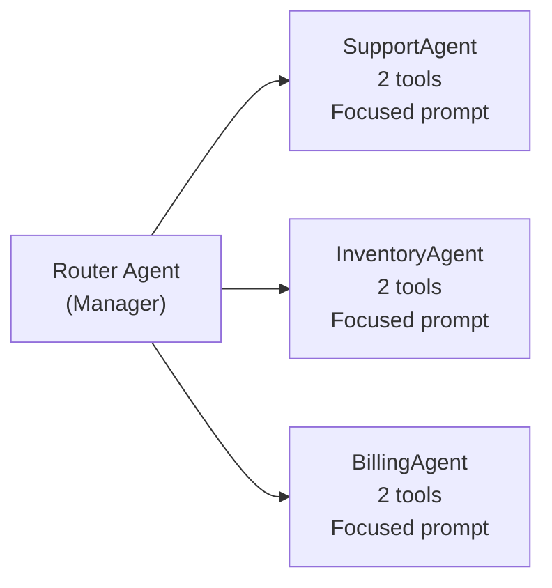
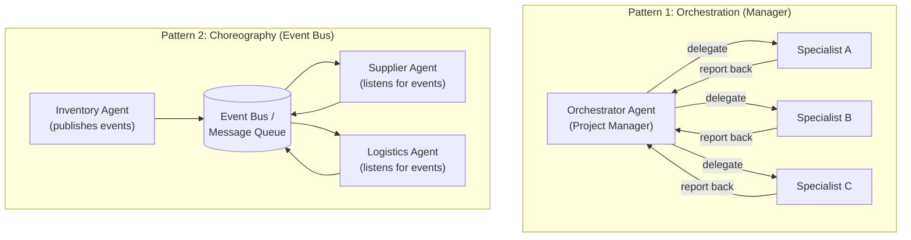
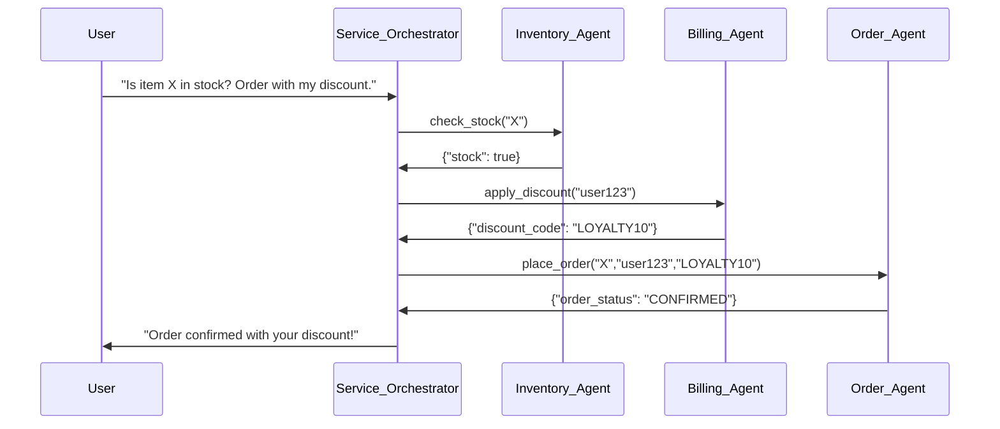
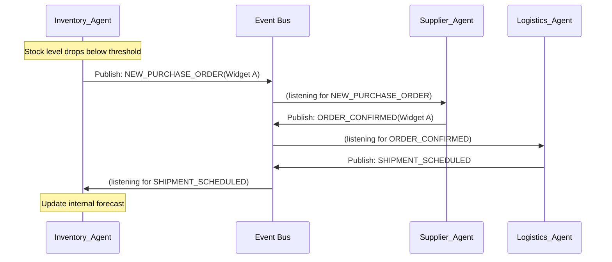
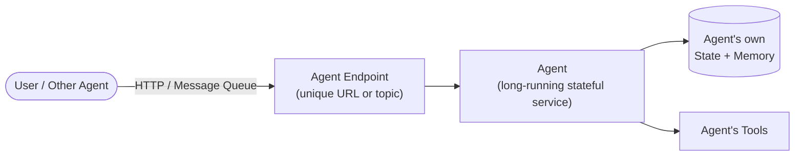

# 05 — Multi-Agent Systems: Orchestration & Choreography

> **Key idea:** Move from "agent psychology" (how one agent thinks) to "agent sociology" (how many agents collaborate). A single agent is a Worker; Agentic AI is the Factory.

---

## AI Agent vs. Agentic AI

| Aspect | AI Agent | Agentic AI |
|--------|---------|------------|
| **Scope** | Single component | Entire system |
| **Analogy** | A skilled freelancer | The software company that employs freelancers |
| **Focus** | Implementation (anatomy) | Architecture (interaction + integration) |
| **Challenge** | Task Execution | System Orchestration |
| **Defined by** | Its tools, memory, brain | Communication protocol, coordination pattern, shared goal |

---

## The "Super-Agent" Anti-Pattern

> If one agent is good, is one **giant** "super-agent" better? **No.**

**Solution: The "Digital Team" pattern** — build a team of micro-agents.

**Benefits:**
- Small, clear prompts per agent
- Each agent has only the tools it needs
- Each is a testable, replaceable component

---

## Why Multi-Agent Systems?

### Power 1 — Specialization
Each agent does **one thing perfectly**.

| Agent | Prompt Persona | Tools |
|-------|---------------|-------|
| ResearchAgent | "Thorough and objective" | `web_search()` |
| CopywriterAgent | "Creative, engaging, witty" | *(none needed)* |
| LegalAgent | "Precise, risk-averse, formal" | `review_contract()` |

### Power 2 — Parallelization

| Approach | Time |
|----------|------|
| Monolithic (sequential) | 10s (task A) + 5s (task B) = **15s** |
| Multi-agent (parallel) | max(10s, 5s) = **10s** |

### Power 3 — Debate & Critique
- **WriterAgent** produces draft
- **CriticAgent** reviews draft and provides feedback
- **WriterAgent** revises based on critique

---

## What is a Multi-Agent System (MAS)?

**Three required ingredients:**
1. **Multiple Agents** — two or more autonomous agents
2. **Shared Environment** — common world (data, APIs, message bus)
3. **Common Goal** — collectively solving a problem beyond any single agent's capability

---

## The Two Primary Coordination Patterns

---

## Pattern 1 — Orchestration ("The Manager")

A single, central Orchestrator Agent manages the entire workflow.

**How it works:**
1. Orchestrator receives user's complex goal
2. Plans the overall sequence of steps
3. Delegates each step (as a sub-goal) to the appropriate Specialist
4. Waits for the Specialist's response
5. Synthesises results and determines the next step

**Example: E-Shop Customer Service**

**Tradeoffs:**

| ✅ Pros | ❌ Cons |
|---------|---------|
| Simple to design, understand, and debug | Single point of failure |
| Logic is centralized | Adding a new step requires changing the Orchestrator |
| Clear flow of control | Less flexible |

---

## Pattern 2 — Choreography ("The Event Bus")

No central manager. Agents are autonomous and reactive.

**How it works:**
- Agents act by publishing events to a shared bus
- Other agents listen for relevant events and react independently
- No one "tells" anyone what to do — it emerges from the event stream

**Example: Autonomous Supply Chain**

**Tradeoffs:**

| ✅ Pros | ❌ Cons |
|---------|---------|
| Flexible, scalable, resilient | Much harder to debug and monitor |
| No single point of failure | Risk of infinite loops or unexpected interactions |
| Easy to add new agents | Overall flow is emergent, not explicit |

---

## Choosing the Right Pattern

| Use Orchestration When… | Use Choreography When… |
|------------------------|------------------------|
| Workflow requires central control | System is decentralised by nature |
| Complex planning and synthesis needed | Components react independently to events |
| Clear sequence of steps (customer service) | Many independent autonomous actors (supply chains, IoT) |
| Debugging priority is high | Scalability and resilience are the priority |

---

## The "Agent-as-a-Service" Pattern

The most common scalable architectural pattern.

Each agent has:
- A unique endpoint (API or message queue topic)
- Its own internal state and memory
- The ability to be "called" by users or other agents

> This makes agents **first-class citizens in a microservices world**.

---

## System-Level Challenges

| Challenge | Problem | Architect's Solution |
|-----------|---------|---------------------|
| **Observability** | Distributed thought process across 5 agents | Distributed tracing + centralised logging |
| **Emergent Behaviour** | Unexpected feedback loops or conflicts | Testing, simulation, robust guardrails |
| **Communication Failure** | Protocol mismatch, API changes, network issues | Versioning, retries, circuit breakers |
| **Goal Conflict** | Two agents competing for the last seat / resource | Negotiation, prioritisation, locking mechanisms |

---

> ⬅️ [04 — Memory & RAG](./04_memory_and_rag.md) | ➡️ [06 — Agentic Workflows](./06_agentic_workflows.md)
