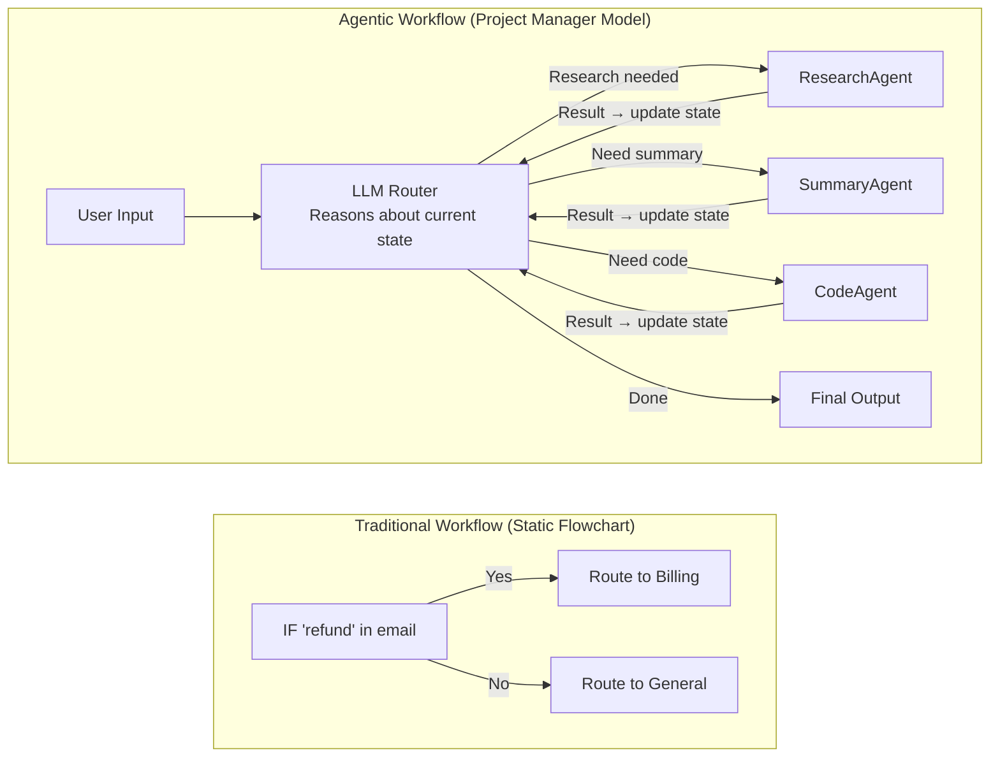
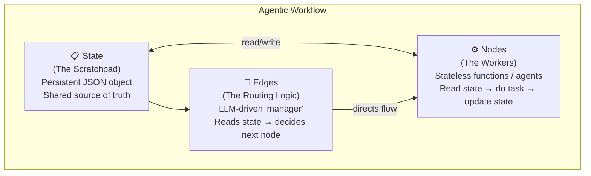
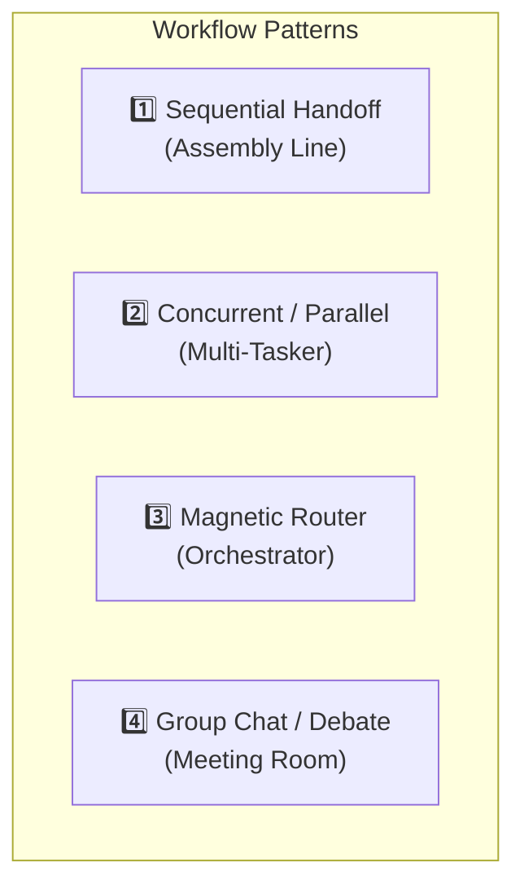
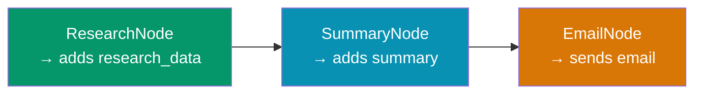
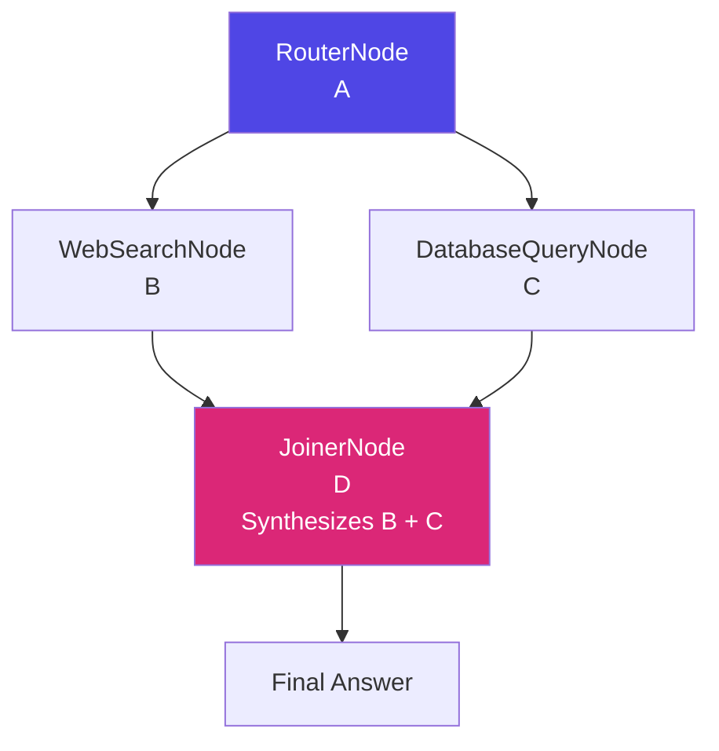
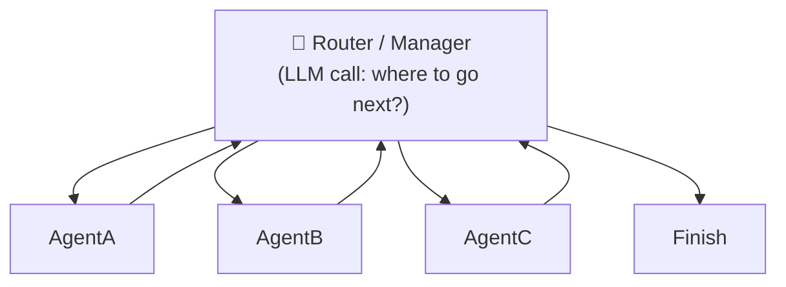
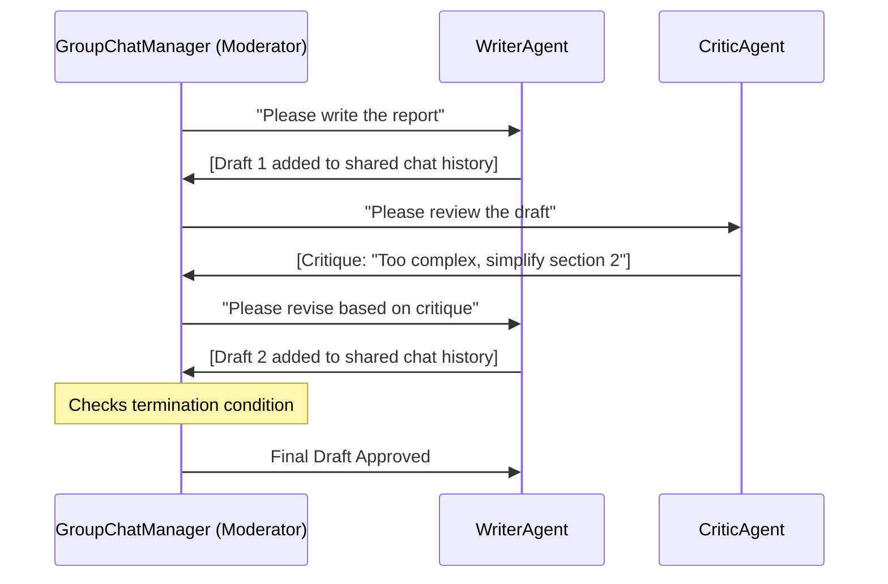
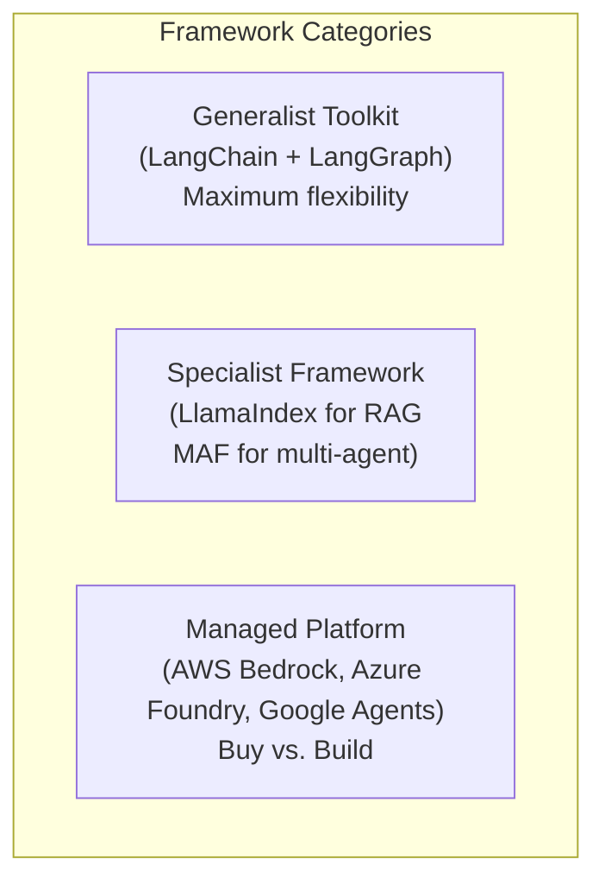

# 06 — Agentic Workflows: Patterns & Frameworks

> **Key idea:** An Agentic Workflow is not a static flowchart. It is an intelligent "project manager" that decides the next best step at runtime using an LLM.

---

## Traditional vs. Agentic Workflow



| Feature | Traditional Workflow | Agentic Workflow |
|---------|---------------------|-----------------|
| **Path defined by** | Humans in advance | LLM at runtime |
| **State** | None | Stateful scratchpad |
| **Routing logic** | Static if/else | LLM call (reasoning) |
| **Adaptability** | Fixed, brittle | Non-deterministic, adaptive |

---

## The 3 Core Anatomy Components

Every agentic workflow is built from these 3 parts:



### Component 1 — State (The Scratchpad)

A persistent JSON object that is the **single source of truth** for the workflow.

```json
{
  "user_query": "Write a report on AI trends",
  "research_data": null,
  "summary": null,
  "final_report": null
}
```

After the ResearchNode runs:

```json
{
  "user_query": "Write a report on AI trends",
  "research_data": "AI trends include: LLMs, Agents, RAG...",
  "summary": null,
  "final_report": null
}
```

### Component 2 — Nodes (The Workers)

- A **stateless** function, tool, or agent
- Receives the current state, does its job, returns an update
- Does NOT know (or care) what happened before or after
- Principle: **Separation of Concerns** (ResearchNode only searches, SummaryNode only summarises)

### Component 3 — Edges (The Routing Logic)

| Type | How it works |
|------|-------------|
| **Deterministic Edge** | `IF research_data is not null THEN go to SummaryNode` |
| **Agentic Edge** | `[LLM CALL]: Given this state, which agent next: [Researcher, Summariser, Coder, Finish]?` |

---

## The 4 Core Workflow Patterns



---

### Pattern 1 — Sequential Handoff ("Assembly Line")

Fixed, linear sequence. Each node's output is the next node's input.



- **Edge logic:** Hardcoded deterministic `IF A done → go to B`
- **Use case:** Simple, predictable, multi-step tasks
- **Benefit:** Reliability, simplicity, easy to debug

---

### Pattern 2 — Concurrent / Parallel ("Multi-Tasker")

Workflow "forks" to run multiple nodes simultaneously, then "joins" to synthesize.



- **Use case:** Speed and efficiency when tasks are independent
- **Benefit:** Total time = time of the longest task, not sum of all

---

### Pattern 3 — Magnetic Router ("Orchestrator")

A central Manager node re-evaluates state after every worker, deciding the next step.



- "Magnetic" because all work flows **back to it**
- **Use case:** Adaptive, autonomous, stateful workflows
- **Benefit:** Most flexible pattern — can dynamically select any agent

---

### Pattern 4 — Group Chat / Debate ("Meeting Room")

Multiple agents interact in a shared chat context, moderated by a GroupChatManager.



- **State:** A list of chat messages (shared whiteboard)
- **Use case:** High-quality generation, complex problem-solving, self-correction
- **Benefit:** Emergent quality through debate
- **Cost:** Every message = one LLM call → expensive

---

## Pattern Comparison

| Pattern | Use Case | Benefit | Trade-off |
|---------|---------|---------|-----------|
| **Sequential** | Known, linear process | Reliable, simple | Rigid — breaks if one step fails |
| **Parallel** | Independent tasks | Fast (concurrent) | Orchestration complexity |
| **Magnetic Router** | Adaptive, unknown path | Flexible, adaptive | Non-deterministic, costly |
| **Group Chat** | Creative, complex problems | High quality | Expensive (many LLM calls), chaotic |

---

## Frameworks for Building Workflows



### LangChain / LangGraph

| | LangChain | LangGraph |
|--|---------|---------|
| **What it is** | Generalist toolkit of LLM components | Stateful cyclic workflow engine |
| **Core concept** | LCEL (pipe operator chains) | State + Nodes + Edges graph |
| **Best for** | Composing components, simple chains | Custom stateful, cyclic agents |
| **Limitation** | Pre-built executors are "black boxes" | Higher complexity, steep learning curve |

### LlamaIndex ("Data-First")

- Focused on **data architecture first**, agent second
- Best for: **Agentic RAG**, multi-source data queries
- Core: Data Connectors → Indexes → Query Engines → RAG Pipelines

### Microsoft Agent Framework (MAF)

- Successor to AutoGen + Semantic Kernel — "best of both worlds"
- Best for: **Enterprise-grade** multi-agent systems, .NET/Azure stack
- Features: Graph-based workflows, Checkpointing, HITL, MCP integration

---

## Build vs. Buy Decision Framework

| Use **Managed Platform** (Buy) When: | Use **Code-First Framework** (Build) When: |
|--------------------------------------|-------------------------------------------|
| Simple, well-defined, internal task | Task is complex or non-deterministic |
| Deep integration with one cloud provider | Need multi-agent collaboration (Group Chat) |
| Fast time-to-market is priority | Agent's reasoning is your competitive IP |
| | Multi-cloud / vendor-neutral required |

---

> ⬅️ [05 — Multi-Agent Systems](./05_multi_agent_systems.md) | ➡️ [07 — Design Patterns](./07_design_patterns.md)
