# 07 — Agentic Design Patterns ("The Gang of Four for Agents")

> **Key idea:** Patterns are **framework-agnostic blueprints** — proven, reusable solutions to common problems in agentic design. They are the "what" and "why", not the "how".

---

## Pattern Catalogue Overview

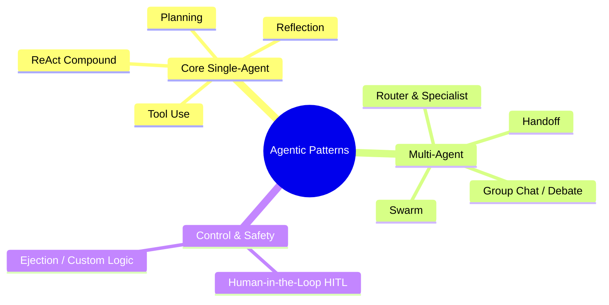

---

## The 4 Design Principles (Laws of Physics for Agents)

| Principle | Concept | Architectural Implication |
|-----------|---------|--------------------------|
| **Goal-Directed** | Driven by objective, not instruction | The 'Goal' is the primary input; planning is derived from it |
| **Reactive** | Perceives and responds to environment | The loop must be a **cycle**, not a straight line |
| **Stateful** | Remembers what has happened | Must design a **Memory component** (DB or state object) |
| **Autonomous** | Acts on its own to make progress | Must grant the agent **agency** (ability to call APIs/write files) |

---

## 🔧 Core Pattern 1 — Tool Use

> "Giving the brain hands to interact with the world."

**The problem:** LLMs are "Text-In, Text-Out". They cannot browse the web, check a DB, or know the current date.

**The 3-part architecture:**

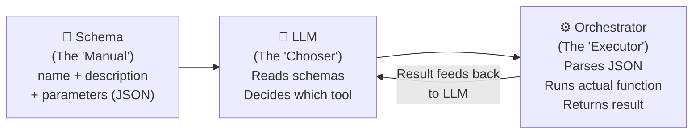

**The function-calling flow:**

1. LLM receives user goal + list of tool schemas
2. LLM outputs structured JSON: `{"tool_call": {"name": "get_weather", "arguments": {"city": "London"}}}`
3. Orchestrator catches the JSON, maps it to real code, executes it
4. Result returned to LLM as an observation

**Architect's notes:**
- **Tool description quality = prompt quality** — a bad description means the tool will never be used
- **Security**: Orchestrator must validate ALL arguments (prevent SQL injection)
- **Error handling**: What happens when the tool returns an error? The agent must handle it

---

## 🗺️ Core Pattern 2 — Planning

> "Giving the brain an internal monologue."

**The problem:** Single tool calls can't solve multi-step goals. "Email me the weather in London" requires `call_weather()` then `call_email()`.

**Chain of Thought (CoT) prompting:**

```
Standard Prompt:     "Email me the weather in London."
CoT / Planning:      "Email me the weather in London. 
                      First, create a plan. Then execute the first step."
```

**LLM output (CoT with plan):**

```
Thought: The user wants the weather emailed.
Plan:
  1. Call get_weather("London")
  2. Call send_email with the result of step 1
Action: [call_weather("London")]
```

**Orchestrator becomes a State Machine:**

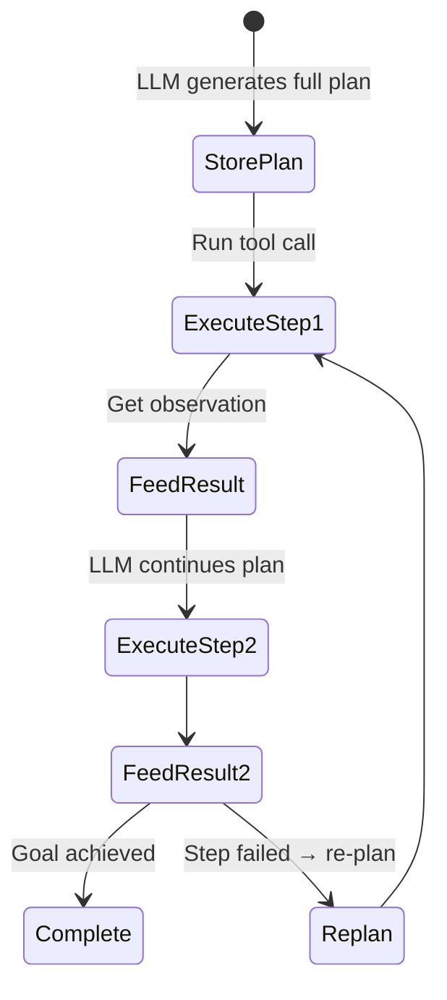

---

## 🪞 Core Pattern 3 — Reflection (Metacognition)

> "Thinking about your own thinking." The difference between a first-draft and a final-draft agent.

**The problem:** An agent can follow a plan perfectly but still produce low-quality output. It is "quality-blind."

**The Writer-Critic model:**

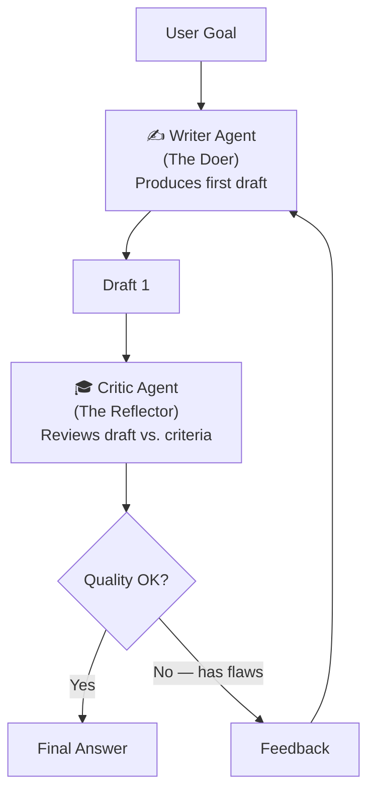

**Architect's notes:**
- Each reflection loop = at least one additional LLM call (doubles cost + latency)
- Requires a cyclic orchestrator (e.g. LangGraph — simple chains can't loop)
- Must design two distinct system prompts: Writer persona + Critic persona
- Must set a **max iteration limit** to prevent infinite loops

---

## ⚡ Core Pattern 4 — ReAct (Reason + Act)

> The compound pattern that combines Planning + Tool Use in a tight, iterative loop.

**The problem with rigid plans:** If search fails in step 1, a static plan still tries step 2 (email an empty list).

**ReAct = Plan-Act-Observe-Plan-Act-Observe…**

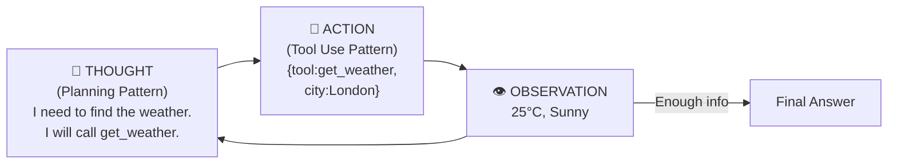

**Full example loop:**

| Loop | LLM Thought | Action | Observation |
|------|------------|--------|-------------|
| 1 | "I need weather for London" | `call_weather("London")` | "25°C, Sunny" |
| 2 | "I have the info. I can answer." | Generate final response | — |

**Why it's "compound":**
ReAct = Planning (Thought) + Tool Use (Action) + the Loop that feeds Observation back.

The Reflection pattern can also be embedded:

```
Reason → Act → Observe → Reason (Reflection: "draft is weak") → Act (critique_draft) → ...
```

**Architect's notes:**
- A 5-step task = 5–6 LLM calls → expensive and slow
- Benefit: Adaptive — if search fails, agent knows it failed and can re-plan
- Implemented by LangChain as the "Agent Executor"

---

## 👥 Multi-Agent Pattern 1 — Router & Specialist

> The fundamental delegation pattern. "Manager & Worker" model.

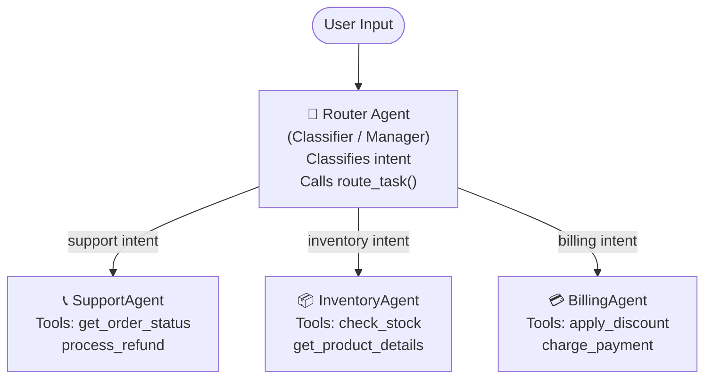

**Architect's benefits:**
- **Modularity** — add a new department by building one new Specialist + updating Router's list
- **Performance** — Router call is fast & cheap (classification only)
- **Testability** — each Specialist can be tested in isolation

---

## 🔗 Multi-Agent Pattern 2 — Handoff (Sequential Workflow)

> "Assembly Line" — fixed, predetermined sequence of specialists.

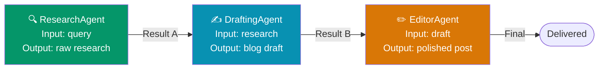

- **Mechanism:** Output of Agent A → saved to Workflow State → input to Agent B
- **Benefit:** Most reliable, deterministic, easy to debug
- **Trade-off:** Rigid — cannot adapt if one step fails

---

## 💬 Multi-Agent Pattern 3 — Group Chat / Debate

> "Digital Meeting Room" — discovery through conversation.

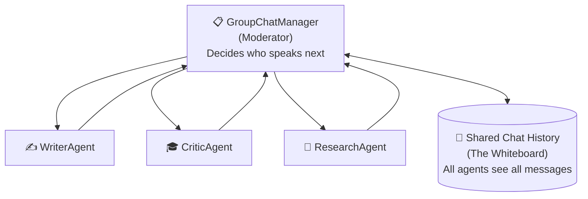

- **State:** Shared list of chat messages (every agent sees everything)
- **Use case:** Complex, creative, poorly-defined problems where **quality** is #1
- **Cost:** Every turn = one expensive LLM call
- **Risk:** Agents can get "stuck in a loop" without a termination condition

---

## 🐝 Multi-Agent Pattern 4 — Swarm (Parallelization)

> "Beehive / Army of Workers" — MapReduce for AI agents.

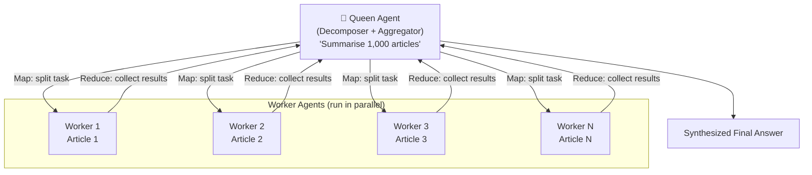

- **Use case:** Massive scale, "embarrassingly parallel" tasks (N documents, N images)
- **Constraint:** Workers CANNOT communicate with each other
- **Cost:** 1,000 workers = 1,000 simultaneous LLM calls — profoundly expensive
- **Benefit:** Speed: 1,000x faster than sequential processing

---

## 🛑 Safety Pattern 1 — Human-in-the-Loop (HITL)

> "The Co-Pilot's Confirmation" — the ultimate safety net.

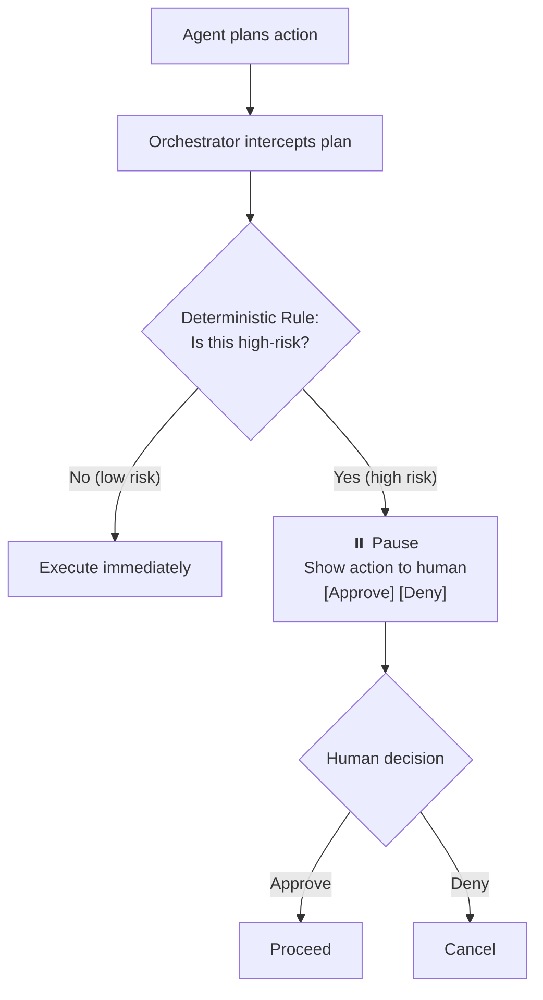

**The Checkpoint Architecture (code logic):**
```python
if tool_name == 'refund_customer' and amount > 1000:
    # Transition to human_approval state
    pause_and_notify_human(action_plan)
else:
    execute_tool(tool_name, args)
```

**Key design decision:** Setting the **threshold** is a core **business logic** decision:
- Too low → alert fatigue, expensive, doesn't scale
- Too high → too much risk

---

## 🚪 Safety Pattern 2 — Ejection / Custom Logic

> "The Escape Hatch / Big Red Stop Button" — a deterministic override.

**Difference from HITL:**
- HITL = agent is working correctly, but action is dangerous → **pause and confirm**
- Ejection = agent is failing OR user wants out → **bypass the agent entirely**

**Trigger scenarios:**
1. User frustration: "You're useless, let me talk to a human!"
2. User termination: "Stop", "Cancel", "Nevermind"
3. Policy violation: Abusive language, forbidden topic

**Architecture — "Pre-Check" Filter (runs BEFORE the LLM):**

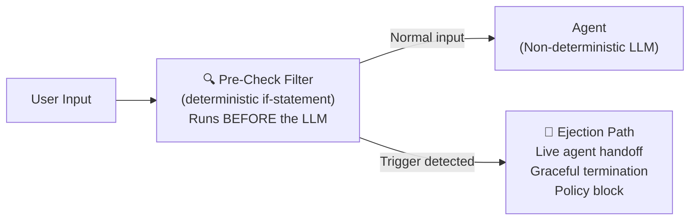

---

## Pattern Selection Guide

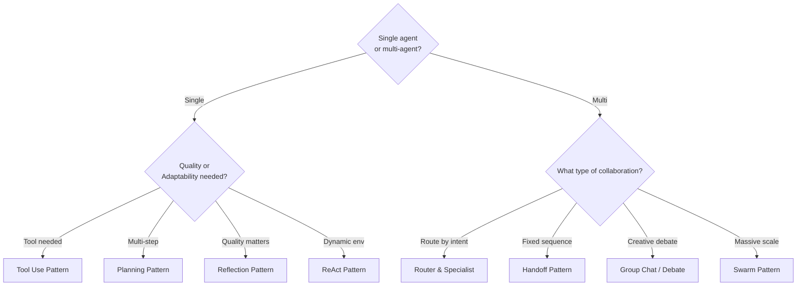

---

> ⬅️ [06 — Agentic Workflows](./06_agentic_workflows.md) | ➡️ [08 — Agentic RAG](./08_agentic_rag.md)
