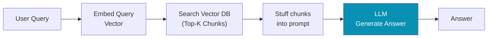
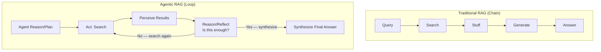
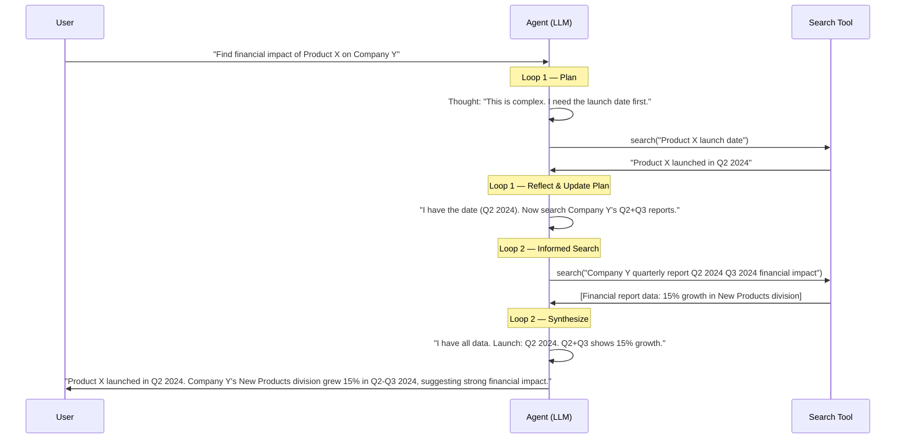
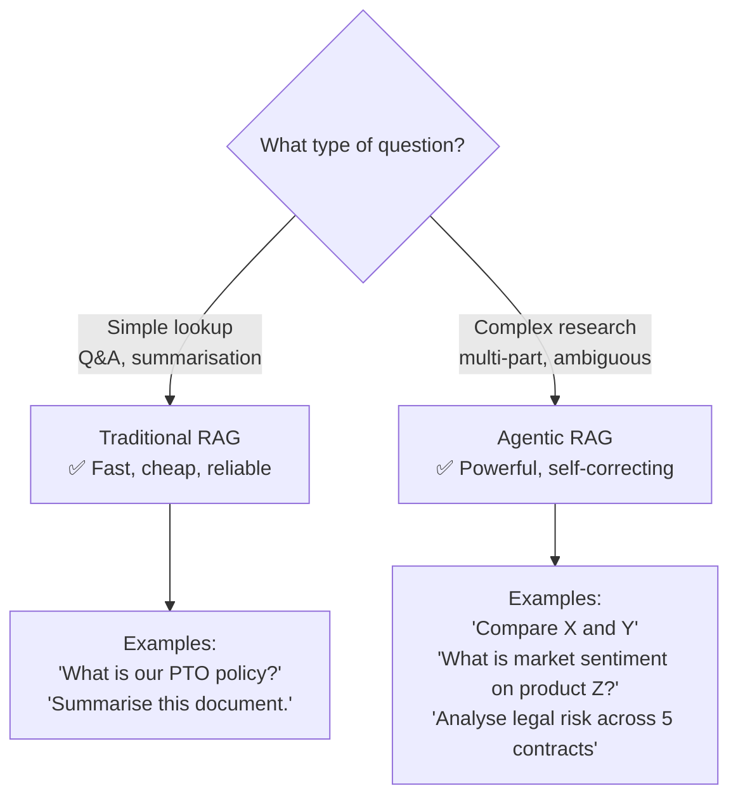

# 08 — Agentic RAG: Advanced Reasoning Over Data

> **Key idea:** Traditional RAG is a passive, one-shot "chain". Agentic RAG is an active, multi-step "loop" where the LLM orchestrates the entire retrieval process.

---

## Traditional RAG — Recap & Limitations

### What is Traditional RAG?

**Goal:** Answer a user's question using private documents instead of the LLM's general training data.  
**Mantra:** "Don't let the LLM guess the answer. Give it the answer and ask it to summarise it."



### The 3 Core Limitations

| Limitation | Description |
|-----------|-------------|
| **One-Shot Retrieval** | Searches once. If Top-K results are bad, the entire process fails |
| **Cannot Self-Correct** | LLM cannot say "these results are useless, search again differently" |
| **Fails on Complex Questions** | "Compare our Q3 revenue vs. competitor's Q3" — a single search can't find both |

> Traditional RAG is a **retriever** system, not a **reasoning** system.

---

## Agentic RAG — The Architectural Shift

**Core shift:** The LLM moves from the **end** of the chain to the **orchestrator** of the entire loop.



---

## The 3 Superpowers of Agentic RAG

| Superpower | Solves | How |
|-----------|--------|-----|
| **Multi-Step Retrieval** | One-Shot Limitation | Agent can search, read, and search again progressively |
| **Reflection & Self-Correction** | Dumb Retrieval | Agent critiques its own results: "These are irrelevant, rephrasing query" |
| **Autonomous Planning** | Complex Multi-Part Questions | Agent decomposes: "Compare X and Y" → 1. Search X, 2. Search Y, 3. Synthesize |

---

## The Active Researcher Loop — Step by Step

**Scenario:** "Find the financial impact of Product X on Company Y"



---

## Agentic RAG vs. Traditional RAG: The Critical Comparison

| Aspect | Traditional RAG | Agentic RAG |
|--------|----------------|-------------|
| **Architecture** | Fixed linear chain | Dynamic cyclic loop |
| **Process** | Search once | Search → Reflect → Search again |
| **Intelligence used** | Only at the end (generate) | Throughout (plan, retrieve, reflect, synthesise) |
| **Self-correction** | ❌ No | ✅ Yes |
| **Multi-step queries** | ❌ Fails | ✅ Handles |
| **Speed** | ⚡ Fast (1 LLM call) | 🐢 Slow (multiple LLM calls) |
| **Cost** | 💰 Low | 💰💰💰 High |
| **Complexity** | Simple, easy to debug | Complex, non-deterministic |

---

## When to Use Which?



---

## Agentic RAG Use Cases

### Use Case 1 — Complex Comparative Research

**Query:** "Compare chip architectures of Nvidia, AMD, and Intel from last 3 years"

**Why Traditional RAG fails:** No single document answers this. A single search returns noise.

**How Agentic RAG succeeds:**
```
Plan:
1. search("Nvidia chip architecture 2023-2025")
2. search("AMD chip architecture 2023-2025")
3. search("Intel chip architecture 2023-2025")
4. synthesize_comparison(result_1, result_2, result_3)
```

---

### Use Case 2 — Automated Due Diligence

**Query:** "Analyse the market sentiment and financial health of Company Z"

**Why Traditional RAG fails:** "Sentiment" and "financial health" are ambiguous — vector search is useless.

**How Agentic RAG succeeds (strategy formulation):**
```
Plan:
1. search("Company Z latest quarterly earnings report")   ← financial health
2. search("Company Z stock analyst ratings 2025")         ← sentiment
3. search("Company Z product launch OR scandal news")     ← sentiment
```

---

### Use Case 3 — Scientific / Legal Literature Review

**Query:** "Summarise the consensus on treatment X for condition Y across 50 medical papers"

**How Agentic RAG succeeds:**
- Iteratively searches different angles
- Self-corrects when results are off-topic
- Synthesises across multiple sources into a coherent consensus

---

## Agentic RAG is the ReAct Pattern Applied to Research

```
ReAct Loop:   Reason → Act → Observe → Reason → ...
Agentic RAG:  Plan → Search → Perceive Results → Reflect → Search Again → Synthesize
```

It is NOT a "chain" or "pipeline" — it IS an active, reflective, multi-step process.

---

> ⬅️ [07 — Design Patterns](./07_design_patterns.md) | ➡️ [09 — Protocols & MCP](./09_protocols_mcp.md)
