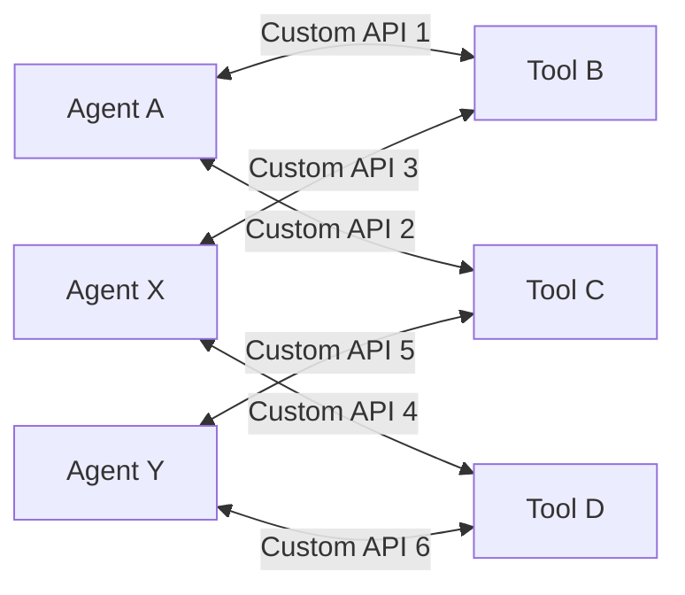
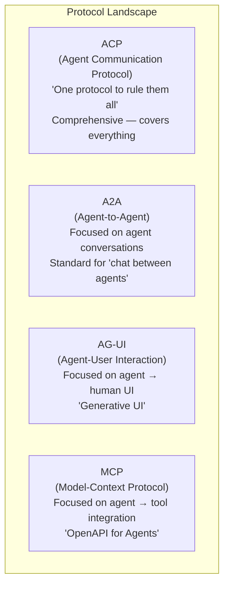
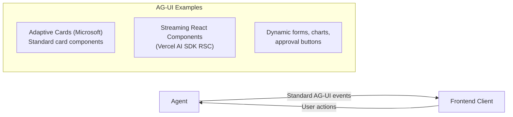
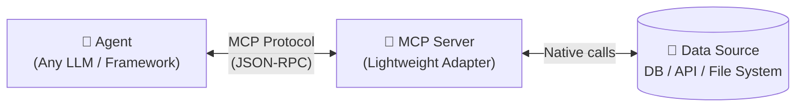
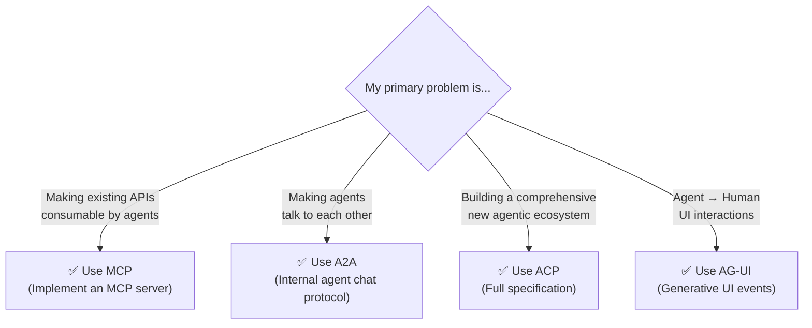
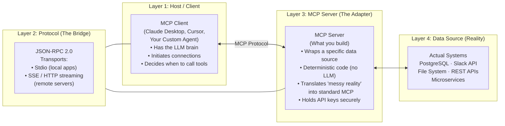
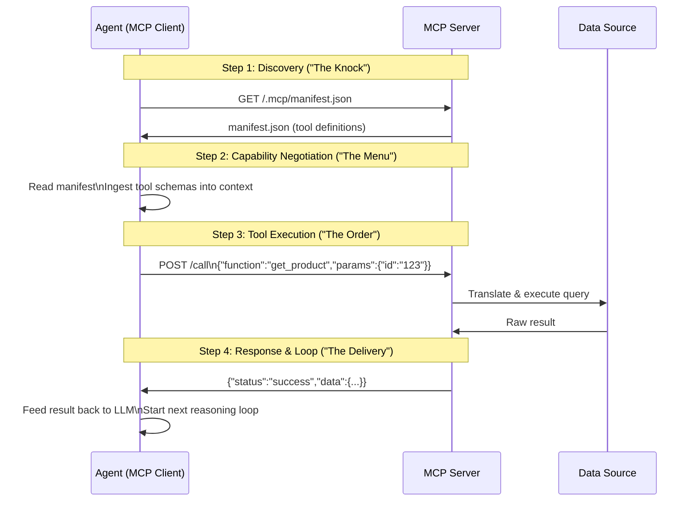
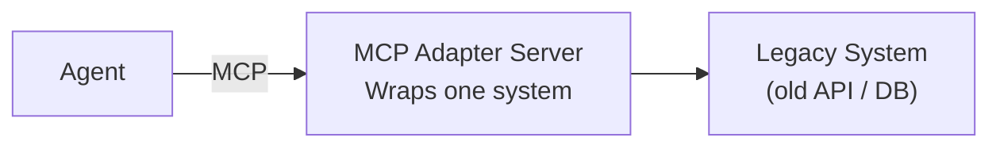
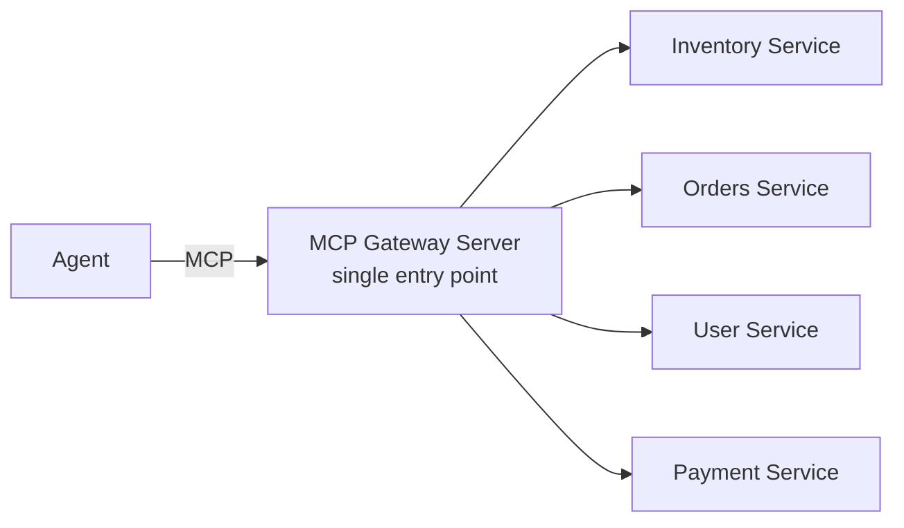
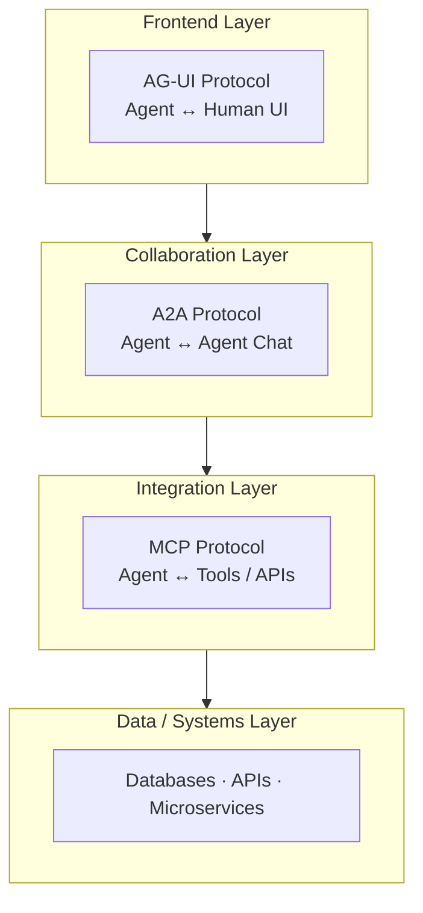

# 09 — Protocols: ACP, A2A, AG-UI & MCP Deep Dive

> **Key idea:** Without common protocols, building a multi-agent ecosystem creates a "Tower of Babel" — N-squared custom integrations. Protocols standardise how agents discover, describe, and communicate.

---

## The Protocol Problem

**The "Obvious" Answer (and why it fails):**  
Custom REST APIs between every pair of agents/tools.



**Result:**
- Vendor lock-in: OpenAI agent locked to OpenAI ecosystem
- N-squared problem: 100 agents → ~5,000 custom integrations
- Fundamentally unscalable

---

## The 4 Emerging Protocols



---

## Protocol 1 — ACP (Agent Communication Protocol)

- Broad, **open-source** specification — universal "language" for all agent interactions
- If HTTP is the protocol for web pages, ACP aims to be the protocol for **tasks / goals**
- A specification (blueprint), not an implementation

**Covers all interaction types:**

| Type | Description |
|------|-------------|
| A2A (Agent-to-Agent) | Collaboration between agents |
| A2T (Agent-to-Tool) | Using external tools |
| A2E (Agent-to-Environment) | Interacting with the world |
| A2H (Agent-to-Human) | Communicating results to users |

**Status:** Emerging standard backed by collaborative accord of AI leaders.

---

## Protocol 2 — A2A (Agent-to-Agent)

- Focused, lightweight protocol for **conversational collaboration** between agents
- Like XMPP (instant messaging protocol) but for agents
- Standardises the **messages** in a collaborative "group chat" or "handoff"

**What A2A standardises:**

| Verb | Meaning |
|------|---------|
| `REQUEST` | "Please do this task" |
| `INFORM` | "Here is the result / information" |
| `PROPOSE` | "Here is my suggestion / plan" |
| `ACCEPT` | "I agree with that proposal" |
| `REJECT` | "I disagree, here's why" |

**Use A2A for:**
- Group Chat / Debate patterns
- Router & Specialist handoffs
- Reflection (Critic's message to Writer)

---

## Protocol 3 — AG-UI (Agent-User Interaction)

- Standardises how agents render **rich, interactive UIs** dynamically
- Moves beyond "Text-In, Text-Out" chatbots to **Generative UI**
- The agent generates the interface **on the fly** based on context



**Critical for:** Human-in-the-Loop (HITL) patterns — presenting agent's proposed action in a rich UI for human approval.

---

## Protocol 4 — MCP (Model-Context Protocol)

> The most important protocol for enterprise architects. "The OpenAPI/Swagger for Agents."

- Lightweight, focused protocol for **Agent-to-Tool** communication
- Solves the most common enterprise problem: making existing APIs consumable by any agent



---

## Protocol Comparison & Decision Matrix



> **Most enterprises start with MCP** — it solves the #1 practical problem: integration.

---

## MCP — Deep Dive Architecture

### The 4-Layer Topology



---

### The MCP Lifecycle — 4 Steps



---

### MCP Core Concepts

**Concept 1 — The /.mcp/ Well-Known Path**

```
GET https://api.my-eshop.com/.mcp/manifest.json
```

The agent doesn't need to be told where the manifest is — it always checks this standard path. Like `robots.txt` for agents.

**Concept 2 — The manifest.json Schema**

```json
{
  "name": "EShop MCP Server",
  "version": "1.0",
  "description": "Tools for interacting with the E-Shop",
  "functions": [
    {
      "name": "get_product_details",
      "description": "Retrieves detailed product information including price, stock, and description. Use this when the user asks about a specific product.",
      "parameters": {
        "product_id": {
          "type": "string",
          "description": "The unique product identifier, e.g. 'SKU-12345'"
        }
      }
    }
  ]
}
```

> **Critical:** The `description` field is the most important part. It's the LLM's "user manual" for the tool.

**Concept 3 — The call Endpoint**

```
POST /call
{
  "function": "get_product_details",
  "parameters": { "product_id": "SKU-12345" }
}

Response:
{
  "status": "success",
  "data": { "name": "Running Shoes", "price": 120, "stock": 45 }
}
```

**Key principle:** JSON in, JSON out. Simple, standard, stateless.

**Concept 4 — Security**

MCP leverages existing web standards:
- `Authorization: Bearer <token>` — OAuth 2.0 / API key
- HTTPS — all communication encrypted
- The **MCP Server holds the API keys** — the agent client never sees them directly

---

### MCP vs. OpenAPI — Why Both?

| | OpenAPI / Swagger | MCP manifest.json |
|--|------------------|-------------------|
| **Consumer** | Human developers | LLM agents |
| **Language** | Technical (developer-speak) | Semantic (LLM-speak) |
| **Size** | Comprehensive (5,000+ lines) | Curated (expose only what agents need) |
| **Purpose** | Full API documentation | Agent-friendly semantic menu |

> **Architect's job:** Use MCP as a "Facade" or "Adapter" in front of your existing OpenAPI systems. You do **not** replace OpenAPI with MCP — you layer MCP on top.

---

## MCP Design Patterns

### Pattern 1 — Adapter Pattern (For a Single Legacy System)



Use when: You have **one** valuable non-agent-aware system to expose.

### Pattern 2 — Gateway Pattern (For Microservices)



Use when: You have **many microservices** and don't want 50 separate MCP servers.

**E-Shop Example:**
- `manifest.json` defines `get_product_details` and `get_order_status`
- Gateway routes `get_product_details` → Inventory Service
- Gateway routes `get_order_status` → Orders Service
- Partner agents have **one simple tool** while internal architecture remains decoupled

---

## The Full Protocol Stack



> A complete enterprise agentic architecture needs all three layers.

---

> ⬅️ [08 — Agentic RAG](./08_agentic_rag.md) | ➡️ [10 — Context Engineering](./10_context_engineering.md)
