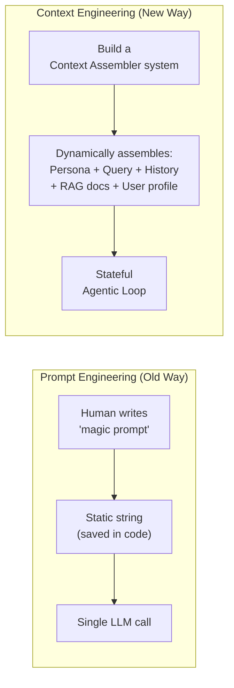
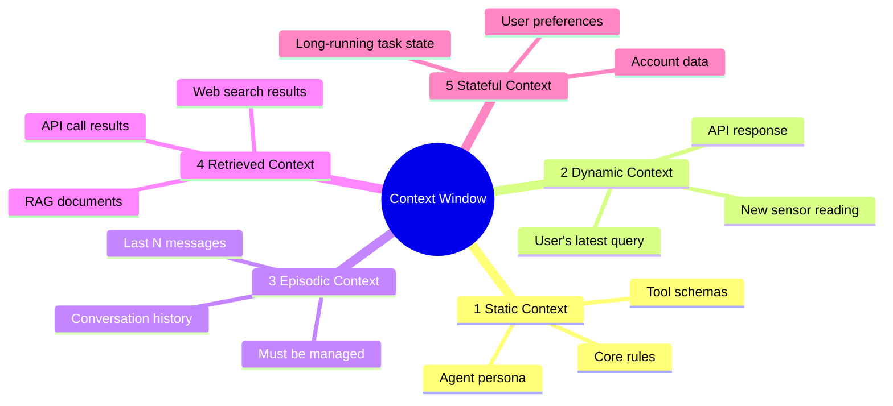
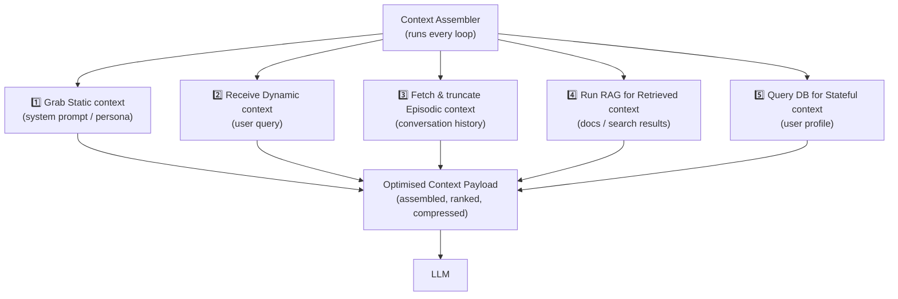
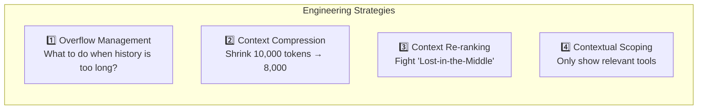
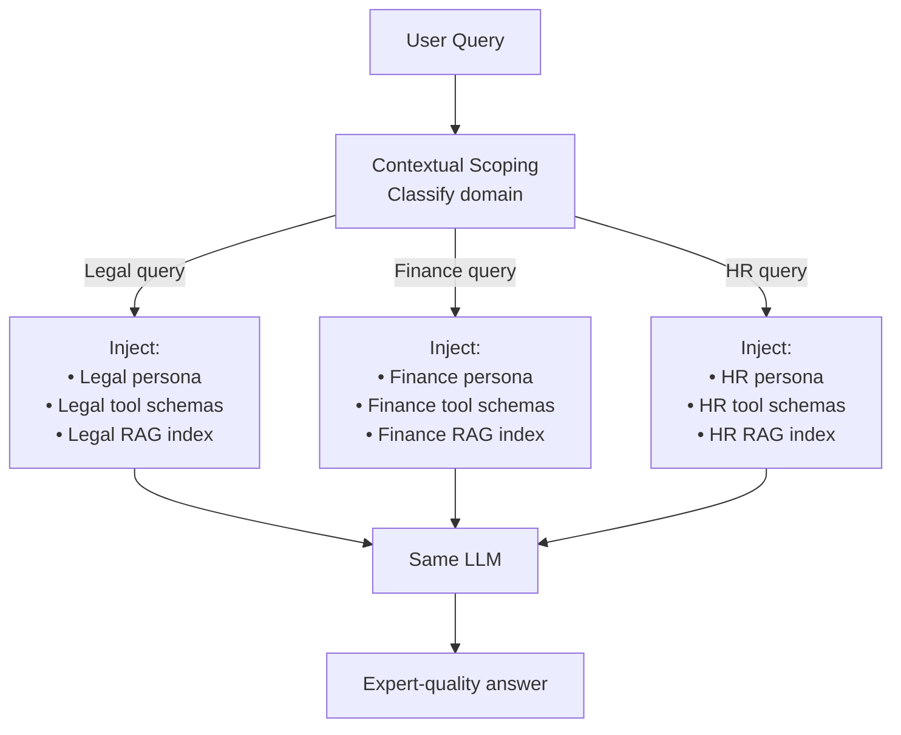

# 10 — Context Engineering

> **Key idea:** The LLM engine is becoming a commodity. The real competitive moat is the **system you build to dynamically source, rank, and engineer the unique context** that feeds into the LLM.

---

## What is Context Engineering?

> **Prompt Engineering** = art of writing a static, one-time instruction for a single LLM call.  
> **Context Engineering** = architectural discipline of designing a system that **dynamically assembles** the entire information payload for every agent loop.



| Feature | Prompt Engineering | Context Engineering |
|---------|-------------------|---------------------|
| **Artifact** | A static string | A dynamic system |
| **Focus** | The instruction ("magic words") | The information flow (the data) |
| **Process** | Manual & static | Programmatic & dynamic |
| **Scope** | A single prompt | Entire context window |
| **Target** | Stateless LLM call | Stateful agentic loop |
| **Role** | Prompt Writer | Information Architect |

---

## The 5 Types of Context



### Type 1 — Static Context ("The Soul")
- Fixed, rarely changes
- The agent's **persona**, core rules, available tool schemas
- Loaded once at startup

### Type 2 — Dynamic Context ("The Trigger")
- The new, immediate event that **initiates the agentic loop**
- User's latest message, an API response, a new sensor reading

### Type 3 — Episodic Context ("Short-Term Memory")
- History of the **current interaction** — the last N messages
- This context **grows** and must be actively managed to prevent overflow
- Connects the turns of a conversation

### Type 4 — Retrieved Context ("External Knowledge")
- Just-in-time information pulled from external sources
- RAG documents, API results, web search data
- This is the "R" in RAG

### Type 5 — Stateful Context ("Long-Term Memory")
- Information pulled from a **permanent, external database** about the user or state
- User preferences, account data, past session summaries
- Enables **true personalisation** and long-running tasks

---

## The Context Assembler — The Architect's Job

For every single agent loop, the Context Assembler must:



---

## The 4 Strategies for Managing the Finite Context Window

**The Core Problem:** You have an ocean of data from 5 context types. You have a bucket (8k–1M tokens). You must programmatically select and assemble the most valuable information.



### Strategy 1 — Context Overflow Management

**Problem:** Episodic Context (chat history) grows indefinitely.

| Technique | How | When to use |
|-----------|-----|------------|
| **Sliding Window** | Keep only last N messages | Short-term context is sufficient |
| **Summarisation** | Periodically summarise old history into one compressed block | Long conversations, need to preserve key facts |
| **Selective Pruning** | Remove low-importance turns | When some turns are clearly irrelevant |

### Strategy 2 — Context Compression

**Problem:** 10,000-token prompt but only an 8,000-token window.

**Technique:** Use a **small, specialised LLM** (e.g. LLMLingua) to compress the prompt before sending to the main LLM.

```
10,000 token prompt 
  → Compressor LLM (e.g. LLMLingua)
  → 6,000 token semantically equivalent prompt
  → Main LLM
```

### Strategy 3 — Context Re-ranking

**Problem:** LLMs suffer from the **"Lost-in-the-Middle"** phenomenon — they attend strongly to the beginning and end of the context, but poorly to the middle.

**Solution:** After RAG retrieval, **programmatically move** the most relevant docs to the **very end** of the context (just before the user's query).

```
Typical RAG stuffing:       [Doc1][Doc2][Doc3]...[Query]
Optimised (re-ranked):      [Less relevant docs]...[Most relevant doc][Query]
```

### Strategy 4 — Contextual Scoping

**Problem:** An enterprise agent might have 200 tools. Showing all 200 schemas floods the context window and confuses the LLM.

**Solution:** Dynamically select **only the tools relevant to the current task**.

```python
# At agent startup: index all 200 tool schemas in a vector DB
# At each turn: embed the user query, search for top-5 relevant tools
# Inject only those 5 tool schemas into the context
relevant_tools = tool_vector_db.search(query=user_query, top_k=5)
```

This is the most "agentic" strategy — dynamic, adaptive, and personalised.

---

## Use Case 1 — Hyper-Personalisation

**Goal:** Move from a generic chatbot to a true personal assistant.

```mermaid
flowchart LR
    USER[User: "Recommend me running shoes"] --> CA2[Context Assembler]

    subgraph STATIC ["Injected Stateful Context (from DB)"]
        P1["shoe_size: 42"]
        P2["preferred_brands: Nike, Adidas"]
        P3["budget_max: $150"]
        P4["past_purchase: Trail runners"]
    end

    CA2 --> STATIC
    STATIC --> LLM2[LLM]
    LLM2 --> RESP["'Based on your size 42, Nike preference\nand $150 budget, I recommend the Nike\nPegasus Trail 4...'"]
```

This level of personalisation comes entirely from **engineering Stateful Context**, not from a better prompt.

---

## Use Case 2 — Dynamic "Expert" Agent

**Goal:** One central agent that can handle multiple expert domains (Legal, Finance, HR) without being a "super-agent."



The "dynamic expert" is achieved by **swapping out the Static Context** (persona + tools + RAG index) based on the query — without building three separate agents.

---

## Context Engineering Quick Reference

| Problem | Strategy | Tool |
|---------|---------|------|
| Chat history too long | Overflow Management | Sliding window / summarisation |
| Prompt exceeds token limit | Compression | LLMLingua or custom summariser |
| RAG docs in the middle ignored | Re-ranking | Move best docs to end of prompt |
| Too many tools confuse LLM | Contextual Scoping | Tool vector DB + dynamic selection |
| LLM gives generic responses | Stateful Context | User profile DB injection |

---

> ⬅️ [09 — Protocols & MCP](./09_protocols_mcp.md) | ➡️ [11 — ADLC & Enterprise](./11_adlc_enterprise.md)
