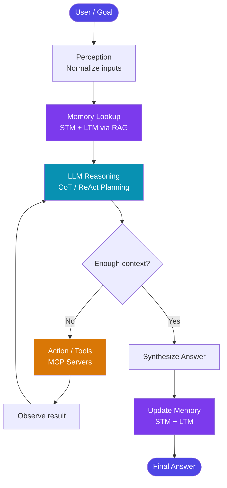

# 🤖 Agentic AI — Complete Study Notes

> **Purpose:** Git-friendly reference notes with embedded Mermaid diagrams

---

## 📚 Table of Contents

| #   | Topic                                                               | File                                                     |
| --- | ------------------------------------------------------------------- | -------------------------------------------------------- |
| 01  | Evolution of AI: GenAI → Agent → Agentic AI                         | [01_evolution.md](./01_evolution.md)                     |
| 02  | AI Agent Fundamentals: Definition, Principles & Components          | [02_agent_fundamentals.md](./02_agent_fundamentals.md)   |
| 03  | The Agentic Loop (PRAL): Perception → Reasoning → Action → Learning | [03_pral_loop.md](./03_pral_loop.md)                     |
| 04  | Memory (STM & LTM) + RAG                                            | [04_memory_and_rag.md](./04_memory_and_rag.md)           |
| 05  | Multi-Agent Systems: Orchestration & Choreography                   | [05_multi_agent_systems.md](./05_multi_agent_systems.md) |
| 06  | Agentic Workflows: Patterns & Frameworks                            | [06_agentic_workflows.md](./06_agentic_workflows.md)     |
| 07  | Agentic Design Patterns (GoF for Agents)                            | [07_design_patterns.md](./07_design_patterns.md)         |
| 08  | Agentic RAG: Advanced Reasoning Over Data                           | [08_agentic_rag.md](./08_agentic_rag.md)                 |
| 09  | Protocols: ACP, A2A, AG-UI & MCP Deep Dive                          | [09_protocols_mcp.md](./09_protocols_mcp.md)             |
| 10  | Context Engineering                                                 | [10_context_engineering.md](./10_context_engineering.md) |
| 11  | ADLC, Evaluation, AgentOps & Enterprise Security                    | [11_adlc_enterprise.md](./11_adlc_enterprise.md)         |

---

## 🗺️ Big Picture — One-Page Mental Model

---

## 📖 Quick Concept Glossary

| Term                    | One-line definition                                                           |
| ----------------------- | ----------------------------------------------------------------------------- |
| **LLM**                 | Large Language Model — the reasoning "brain" of an agent                      |
| **PRAL Loop**           | Perceive → Reason → Act → Learn — the agent's heartbeat                       |
| **STM**                 | Short-Term Memory — the active context window                                 |
| **LTM**                 | Long-Term Memory — external vector/SQL databases                              |
| **RAG**                 | Retrieval-Augmented Generation — load just-in-time facts into STM             |
| **Agentic RAG**         | RAG inside a ReAct loop — multi-step, self-correcting retrieval               |
| **Tool Use**            | Function calling pattern — gives the agent "hands"                            |
| **ReAct**               | Reason + Act compound pattern — the standard agent loop                       |
| **Reflection**          | Writer-Critic inner loop — self-improvement for quality                       |
| **MCP**                 | Model Context Protocol — OpenAPI for agents; standard agent-to-tool interface |
| **A2A**                 | Agent-to-Agent Protocol — structured inter-agent chat                         |
| **HITL**                | Human-in-the-Loop — checkpoint before destructive actions                     |
| **ADLC**                | Agent Development Lifecycle — 7-phase build/test/deploy cycle                 |
| **AgentOps**            | DevOps for agents — cognitive health monitoring                               |
| **Context Engineering** | Architecting the dynamic information payload fed to the LLM                   |
